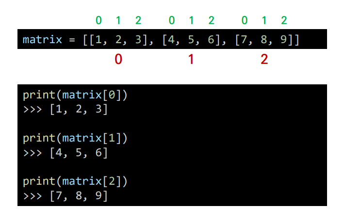
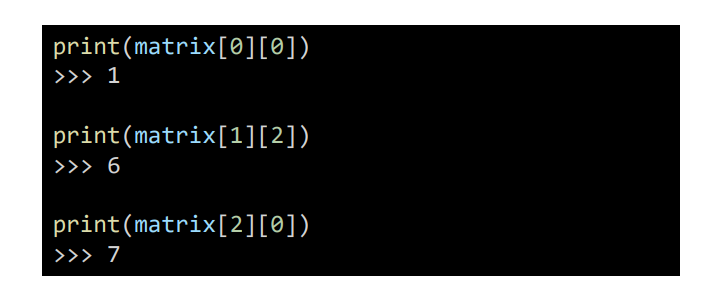
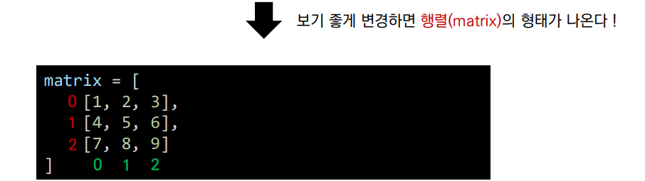
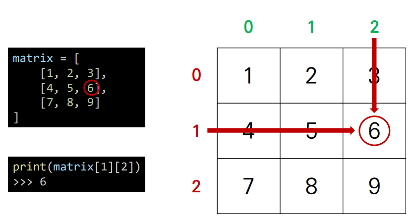
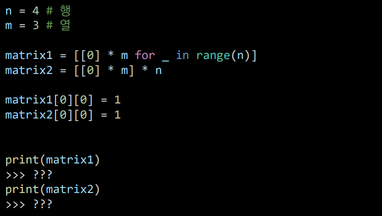
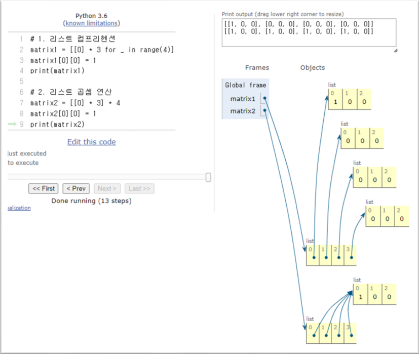
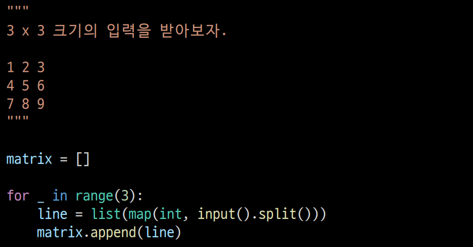
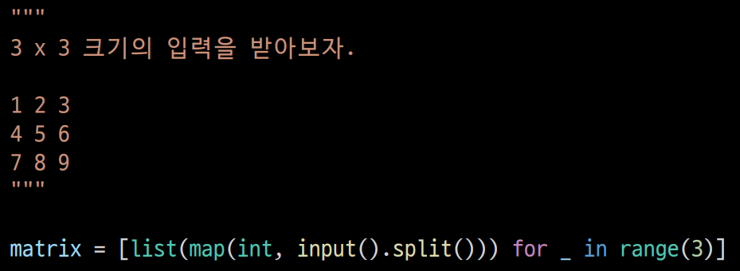
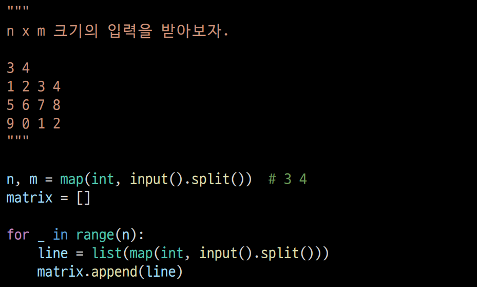
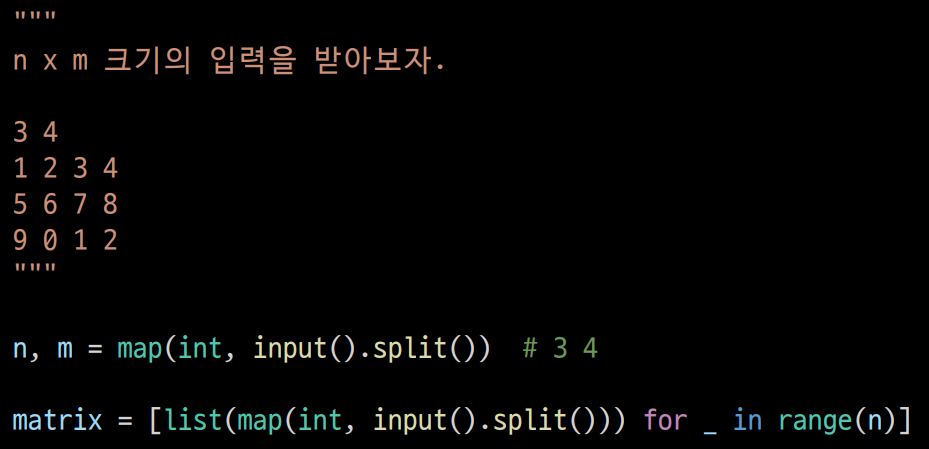

# 1. 이차원 리스트

> 리스트를 원소로 가지는 리스트!
> 리스트 속 리스트!

- 이차원 리스트를 처음 생성할 때 리스트 곱셈을 이용해서는 안된다.

- 하나의 리스트를 여러번 보여주는 것과 같아 자유롭게 원소를 변경하는게 어렵다.

------

# 2. 입력 받기

## 1. 행렬의 크기가 미리 주어지는 경우

- 리스트 컴프리헨션 혹은 for 문으로 쉽게 받아올 수 있다.

## 2. 행렬의 크기가 입력으로 주어지는 경우

- 리스트 컴프리헨션 혹은 for 문으로 쉽게 받아올 수 있다.

