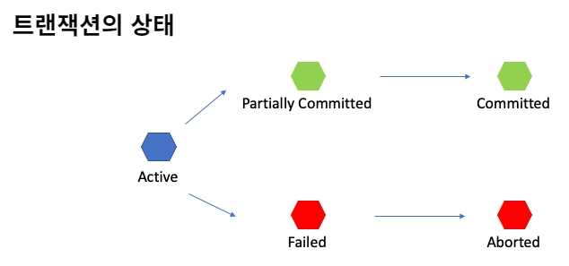

# 01.12

# Transaction과 ACID

## Transaction 정의 

- 데이터베이스의 상태를 변환시키는 하나의 논리적 기능을 수행하기 위한 작업의 단위 또는 한꺼번에 수행되어야할 일련의 연산들을 의미한다.
- 작업의 완전성을 보장한다.
  - 하나의 논리적 작업 셋을 완벽하게 처리하지 못할 경우 중간 과정을 얼마나 진행 하였건 처음 원 상태로 복구해서 작업의 일부만 적용되는 현상을 발생하지 않게 만들어 준다.
- SELECT, UPDATE, INSERT, DELETE 와 같은 연산을 수행하여 데이터베이스의 상태를 변화시키는 작업의 단위

## Transaction 특징 (ACID)

### Atomicity(원자성)

- 트랜잭션이 데이터베이스에 모두 반영되던지, 전혀 반영 되지 않아야 한다.
  - ALL or Nothing
- 트랜잭션 내의 모든 명령은 반드시 완벽히 수행되어야 하며, 어느 하나라도 오류가 발생하면 트랜잭션 전부가 취소되어야 한다.

- ex) 계좌 이체를 한다.
  - 계좌 이체는 두가지 과정을 거친다. 1 . A 계좌에서 돈을 출금한다. 2 . B 계좌에 입금한다.
  - 두 과정중 출금만 성공하고 입금이 실패했다고 가정하자 이 상태 그대로 결과가 저장이 되면 출금된 금액이 사라진 상태로 데이터베이스가 변경되고 돈이 사라지는 현상이 발생한다. 
  - 이러한 경우를 피하기 위해 원자성이 필요한 것이다.

### Consistency(일관성)

- 데이터 베이스의 상태는 항상 일관되어야 한다
- 트랜잭션 이전과 이후, 테이터베이스의 상태는 이전과 같이 유효해야 한다. (기존의 제약이나 규칙을 만족해야 한다.)
- ex) primary key, unique, not null 등과 같은 제약 조건들 
- ex) ''모든 고객은 반드시 이름을 가지고 있어야 한다.(not null)'
  - 만약 트랜잭션이 '이름 없는 고객을 추가' 혹은 '기존 고객의 이름만 삭제' 한다면
  - '반드시 이름을 가지고 있어야 한다.' 는 제약을 위반하여 일관성을 해친다.

### Isolation(독립성)

- 모든 트랜잭션은 다른 트랜잭션으로부터 독입되어야 한다.
- 하나의 트랜잭션을 수행 시 다른 트랜잭션의 연산이 끼어들지 못하도록 보장한다.
- 동시에 여러 개의 트랜잭션들이 수행될 때, 각 트랜잭션은 고립(독립, 격리) 되어 있어 연속으로 실행된 것과 동일한 결과를 나타낸다.

- ex) 용아맥을 예매한다... 제발....
  - 내가 아무리 좌석을 클릭해도 '이미 예매가 진행중인 좌석입니다.' 라는 응답만 받는 것이 독립성의 보장이다.
  - 하나의 좌석을 여러사람이 클릭을 해도 가장 먼저 클릭한 사람이 해당 좌석의 예매를 진행 중이라 다른 사람들의 응답은 거절 되는 것이다.

### Durability(지속성)

- 성공적으로 수행된 트랜잭션은 영원히 반영되어야 한다.
- 수행된 트랜잭션의 로그가 남아야 한다.
- 런타임 오류나 시스템 오류가 발생하더라도, 이전의 로그 기록들은 영구적으로 남아야 한다.

## Transaction 연산

### Commit

- 하나의 논리적 단위(트랜잭션)에 대한 작업이 성공적으로 마무리 되었고 데이터베이스가 다시 일관된 상태에 있을 때, 이 트랜잭션이 행한 연산이 완료된 것을 관리자에게 알려주는 연산이다. 

### Rollback

- 트랜잭션 처리가 비정상적으로 종료되어 데이터베이스의 일관성을 깨뜨렸을 때, 트랜잭션의 원자성을 위해 현재까지 진행하였던 모든 연산을 취소(undo)하는 연산

## Transaction 상태

- Active : 현재 실행 중인 상태
- Failed : 실행되다 오류가 발생해서 중단
- Aborted : 비정상 종료 되어 Rollback 이 진행된 상태
- Partially Committed : 연산이 마지막 까지 실행되고 Commit 이 되기 직전 상태
- Committed : 성공적으로 종료되어 Commit 연산을 실행항 후의 상태

###### 참고

- https://hanamon.kr/%EB%8D%B0%EC%9D%B4%ED%84%B0%EB%B2%A0%EC%9D%B4%EC%8A%A4-%ED%8A%B8%EB%9E%9C%EC%9E%AD%EC%85%98%EC%9D%98-acid-%EC%84%B1%EC%A7%88/
- https://wonit.tistory.com/462
- 