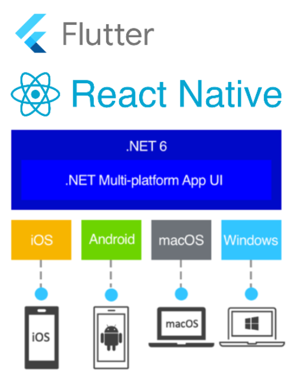
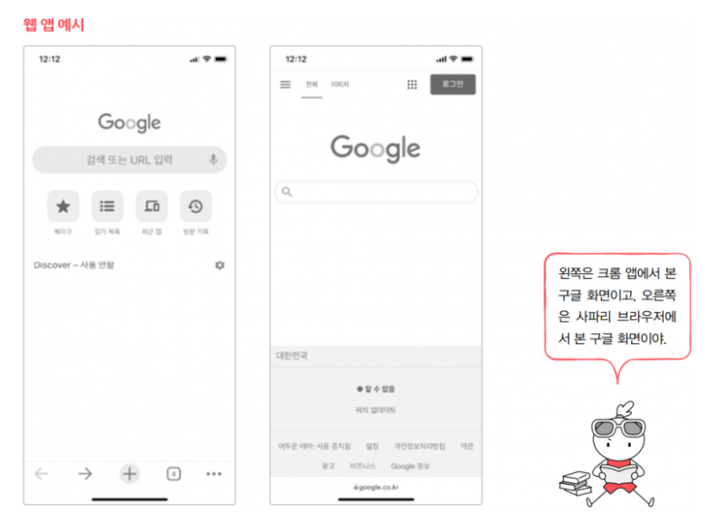
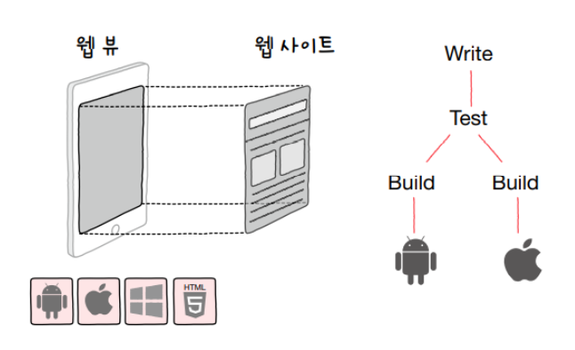

# 네이티브 앱 & 웹 앱 & 하이브리드 앱

## 1. 네이티브 앱

> 모바일 기기는 크게 iOS와 안드로이드 두 가지 운영체제로 양분되어 있는데 각 운영체제에 맞게 앱을 개발한 것이 네이티브 앱 이라고 한다. 이렇게 개발된 네이티브 앱은 각 운영체제의 앱 마켓(iOS 의 앱스토어, 안드로이드의 플레이 스토어)에 업로드 되고 사용자들은 해당 앱 마켓에서만 다운받아 사용이 가능하다.

### 특징

- 네이티브 방식은 해당 운영체제에서 정해준 언어와 툴, 방식을 이용해서 만들어지는 과정
- 운영체제에서 정해준 언어와 툴, 방식은 시간이 흘러감에 따라 변화할 수 있음
  - 안드로이드는 자바와 이클립스를 많이 이용해왔는데 요즘은 코틀린 언어도 사용하고 안드로이드 스튜디오라는 정식툴도 이용한다.

### 장점

- 각 운영체제를 타겟으로 개발되는 방식이라 최적화가 잘 되어 있어 운영체제의 성능을 최대한으로 이용 가능하다.

### 단점

- 운영체제가 다양하게 존재하여 각각의 운영체제에 맞는 개발자를 두거나 다양한 운영체제에 능숙한 개발자가 필요하다.
- 한 회사가 앱을 개발하는데 들어가는 시간이 늘어나게 된다.
- 운영체제에 각각 심사, 유지보수가 들어가기 때문에 앱의 공개와 업데이트에도 시간이 소요된다.

## 2. 크로스플랫폼

> 하나의 어플을 여러 OS별로 개발해야 하는 번거로움을 해소하기 위해 만들어진 프레임워크이다. 이 프래임워크를 이용하면 같은 소스코드를 이용하여 여러 OS에서 작동 가능한 앱을 만들 수 있다. ex) 플러터 (다트), 리액트 네이티브(자바스크립트), 닷넷 마우이(C#)

### 장점

- 하나의 언어로 여러OS의 앱을 프로그래밍 할 수 있다.
- 각각의 네이티브 앱을 제작하는 것보다는 적은 비용과 시간으로 앱 개발을 할 수 있다.

### 단점

- 프로그래밍을 진행하고 출력 과정에서 각각의 OS별 앱이 출력되는 것이다. 따라서 순수하게 특정 OS 만을 위해 만들어진 앱과는 성능의 차이가 있을 수 밖에 없다.
- 여전히 각각의 OS에 심사 과정을 거처야 한다.

## 3. 웹 앱

> 앱 마켓에서 다운받아 사용하는 것이 아니라 크롬이나 사파리 등의 브라우저에서 이용할 수 있는 애플리케이션이다. 넓은 의미로는 모바일에서 사용하기 좋은 모습으로 만들어진 모든 웹사이트를 이야기 하고, 좁은 의미로는 스마트폰 애플리케이션과 유사한 디자인과 UI/UX를 제공하는 웹사이트를 말한다.

​					      왼쪽 크롬 앱에서 보는 구글사이트   ||  오른쪽 사파리에서 보는 구글 사이트

### 특징

- 웹앱은 애플리케이션이라고는 하지만 실질적으로 웹사이트이다.

### 장점

- 웹사이트라서 OS별로 따로 만들 필요가 없다.
- 공개와 유지보수 시에도 따로 조정이나 심사를 받을 필요 없이 자체적으로 진행 가능하다.
- 웹 개발이라 플랫폼 제작 비용도 저렴하고 개발 기간도 짧은 편

### 단점

- 앱이 아닌 웹의 한계가 존재한다
- 높은 사양이 요구되는 작업이나 스마트폰 내부의 파일을 다루는 작업, 하드웨어를 활용하는 기능의 구현이 어려울 수 있다.

## 4. 하이브리드 앱

>웹 사이트를 제공하면서 추가로 앱의 여러 콘텐츠와 기능을 제공하는 앱 ex)NAVER, DAUM 앱

### 특징

- 네이티브 또는 크로스플랫폼 방식으로 앱을 만들면서 화면 안에 직접 사이트를 만들지 않고 **웹 뷰**라는 요소를 만들어 웹 사이트를 띄운다. 웹 뷰는 지정된 주소로 접속하여 웹사이트를 보여준다.
- 그리고 앱에서는 웹 사이트에서 이용하지 못하는 다른 기능들을 제공한다.
- 네이티브 앱과 웹 앱의 장점을 활용하여 제품을 구성할 수 있다.
  - 네이티브 영역에서 최적화를 이루어 성능을 활발하게 활용할 수 있다.
  - 웹 영역에서는 OS에 방해 받지 않고 유지, 보수, 개선이 가능하다.

# 참고

- https://hongong.hanbit.co.kr/%EB%AA%A8%EB%B0%94%EC%9D%BC-%EC%95%B1-%EC%A2%85%EB%A5%98%EB%84%A4%EC%9D%B4%ED%8B%B0%EB%B8%8C-%EC%95%B1-%ED%81%AC%EB%A1%9C%EC%8A%A4-%ED%94%8C%EB%9E%AB%ED%8F%BC-%EC%9B%B9-%EC%95%B1-%ED%95%98/

