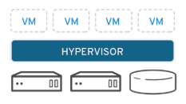
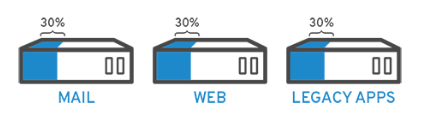
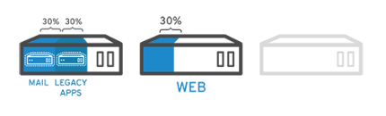
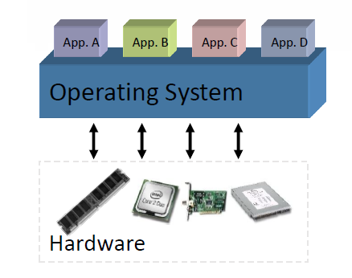
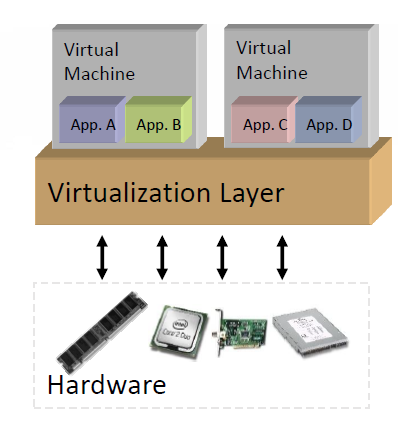
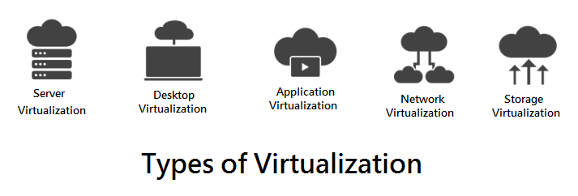
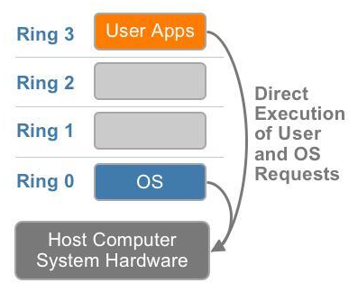
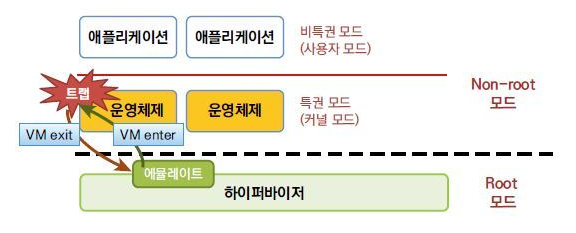
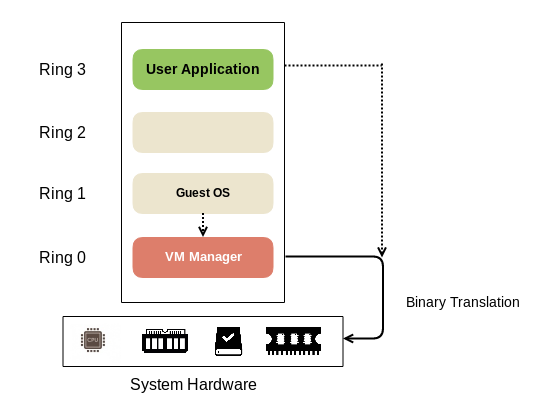

참고 : https://mangkyu.tistory.com/86

# 1. 가상화(Virtualization)란?

가상화란 관리자 역할을 맞은 소프트웨어(주로 hypervisor)를 이용하여 하나의 물리적 머신에서 가상머신(VM)을 만드는 프로세스를 이야기한다. 

hypervisor는 가상화 층을 구현하여 물리적 머신의 컴퓨팅 리소스로부터 가상 환경을 분리하고 가상 머신(VM)을 생성한다. VM은 물리적 머신과 동일한 역할 및 성능을 수행하지만, CPU와 메모리 및 스토리지와 같은 물리적 머신의 컴퓨팅 리소스를 사용한다. Hypervisor는 필요에 따라 각 VM에 이러한 컴퓨팅 리소스를 할당한다.

## 1) 가상화 예시

가상화를 이용하면 서버를 통합(Server Consolidation) 하고 서버의 자원을 최대한으로 활용함으로써 서버 급증 문제(Server Proliferation Problem)를 해겨할 수 있다.

예를 들어, 용도가 다른 3개의 물리 서버가 있다고 가정하자. 1개는 메일서버이고, 다른 1개는 웹 서버이고, 다른 1개는 내무 레거시 애플리케이션을 실행하는 서버이다. 각 서버는 잠재적인 실행 용량의 30%만 사용되고 있지만, 내부 운영을 위해 레거시 애플리케이션이 계속 필요하므로, 레거시 애플리케이션과 이를 호스팅하는 또 다른 3번째 서버를 유지해야 한다.

전통적으로 1개의 서버에 설치된 1개의 OS 위에 1개의 태스크를 수행하도록 하는 것이 더 쉽고 안정적인 경우가 많다. 하지만 이러한 경우 각각의 서버가 자원을 최대한으로 활용하지 않기 때문에 서버 전력비가 비효율적으로 발생하며, 각각의 서버가 서로 다른 공간에 위치하므로 공간 대여 비용도 발생하는 등 각각의 서버를 최대한으로 활용하지 못하고 있다.

그러나 가상화를 사용하면 기존의 메일 서버를 2개로 분리하여 1개의 서버로는 메일을 처리하고, 1개의 서버로는 레거시 애플리케이션을 마이그레이션 할 수 있다.

또한 메일서버를 만약 3개로 분리한다면, 메일 서버의 자원을 최대한으로 활용하고, 남은 2개의 서버는 다른 태스크를 처리하거나 사용을 중지하여 냉각 및 유지 관리 비용을 줄일 수 있다.

------

# 2. 가상화의 장점

## 1) 비가상화

- 1개의 OS가 모든 하드웨어 자원을 관리한다.
- 1개의 머신에서 여러 개의 애플리케이션을 구동하는 것은 충돌 등의 문제를 발생시킬 수 있다.
- 유연하지 못하며, 인프라 비용이 높아질 수 있다.

## 2) 가상화

- 1개의 하드웨어 상에서 여러 개의 가상머신(VM)을 구동할 수 있다.
- 하드웨어와 무관하게 원하는 운영체제나 그에 맞는 애플리케이션을 실행할 수 있다.
- 어떠한 시스템에서도 가상 머신이 프로비저닝 될 수 있다.

## 3) 가상화의 장점

- Server Consolidation : 물리적인 서버의 개수를 줄여 1개의 서버로 통합함으로써 서버의 전력 및 냉각 비용, 하드웨어 공간 비용 등을 줄일 수 있다.
- Isolation : 기능에 맞게 여러 개의 머신으로 분리하여 Failures나 Security Leaks 등에 더욱 잘 대처할 수 있다.
- Efficiency : 컴퓨팅 자원의 사용을 최대화하고 보다 쉽게 관리 할 수 있다.
- Flexibility : 한 서버의 데이터를 마이그레이션하기에 용이해진다.

위의 내용 외에도 가상화를 통해 동일한 머신에서 다양한 유형의 앱, 데스크탑 및 운영체제를 실행할 수 있거나 새로운 애플리케이션을 프로비저닝 하는데 걸리는 시간을 줄일 수 있다는 여러 장점이 있다.

## 4) 클라우드 컴퓨팅에서 가상화의 역할

클라우드 컴퓨팅은 인터넷을 통해 공유 컴퓨팅 리소스, 소프트웨어 또는 데이터를 제공하는 방식이다. 사용자는 클라우드를 통해 컴퓨터의 자원을 Transparent하게 사용할 수 있다. 

가상화는 클라우드 컴퓨팅을 가능하게 하는 주요 기술 중 하나로, 클라우드 공급업체는 가상화를 사용하기 때문에 하나의 서버에서 여러 고객에게 서비스를 제공할 수 있다. 많은 기업들은 가상화 및 클라우드 컴퓨팅을 모두 사용하여 효율성을 극대화 하고 있다.

------

# 3. 하드웨어 가상화의 종류

## 1) 가상화의 종류

가상화에도 서버 가상화, OS-Level 가상화, 데스크톱 가상화, 애플리케이션 가상화, 네트워크 가상화 등이 있다. 그 중에서도 서버를 가상화하는 하드웨어 가상화인 전가상화와 반가상화의 차이에 대해서 설명하겠다.

### (1) CPU의 동작 레벨

서버를 가상화하는 하드웨어 가상화인 전가상화와 반가상화의 차이에 대해 이해하기 위해서는 CPU의 동작 레벨에 대해서 알고 있어야 한다.

OS에서 구동되는 소프트웨어는 보안을 위해 권한과 보호 수전에 따라 링(RING) 등급으로 나뉘어진다.

- Ring 0를 특권 모드하고 하며 시스템 자원을 관리하는 OS 커널이 동작한다.
- Ring 1, 2는 예약된 상태로, 평상시에는 사용되지 않는다.
- Ring 3는 우리가 일반적으로 사용하는 응용프로그램들이 동작한다.

## 2) 전가상화(Full Virtualization)

### (1) 전가상화

전가상화란 호스트 CPU의 가상화 기술을 이용하여 전체 하드웨어를 완전히 가상화하는 기술이다. 여기서 하드웨어를 완전히 가상화한다는 것은 게스트 OS가 자신이 가상화 환경인지 모르는 상태를 의미하며, 그에 따라 가상화되지 않은 실제 하드웨어 명령을 직접 요청하는 것처럼 동작한다.

전가상화를 하면 root 모드와 non-root 모드가 생기게 되는데, 하이퍼 바이저가 root 모드, 운영체제 및 애플리케이션과 같은 도메인이 non-root 모드에 해당된다. 이러한 구조에서 만약 게스트 OS가 특권 명령(Privileged Instruction)을 처리해야 하는 상황이 오면 전가상화는 Trap & Emulate 방식으로 처리를 해준다.

- 정의 : 하드웨어를 완전히 가상화하는 방식으로, 게스트 OS에 아무런 수정 없이 다양한 OS를 이용 가능
- 전제 조건 : CPU의 Intel-VT나 AMD-V 등의 물리적인 가상화 지원 기능이 있어야 함
- 단점 : Trap & Emulate 으로 인한 성능 저하 발생

### (2) Trap & Emulate

Trap 이란 특권 명령을 실행할 권한이 없는 비특권 모드(게스트 OS)에서 특권 명령을 실행할 때 시스템에 발생하는 예외 또는 결함이다. 예를 들어 0으로 나누기(divide by zero)나 디버깅을 위한 중단점(break point)과 같은 처리를 하면 프로그램의 제어권이 트랩 사건을 처리하는 트랩 핸들러로 넘어가게 된다.

전 가상화에서 게스트 OS가 특권 명령을 실행하려고 한다면 Trap & Emulate 방식으로 처리해준다.

Trap & Emulate는 다음과 같이 진행된다.

1. 비특권 모드인 게스트 OS에서 특권 명령을 수행하려 한다.
2. 게스트 OS는 트랩상태(trap state)로 바뀌게 되고, 트랩 핸들러는 VM exit을 통해 제어권을 VMM(Hypervisor)로 넘겨준다.
3. Hypervisor는 해당 명령을 처리한다.(Emulate)
4. 해당 명령의 처리가 끝나면 VM enter을 통해 실행 결과와 함께 제어권을 운영체제로 넘겨준다.

이러한 방식으로 Trap을 처리할 수 있지만 Trap 자체가 발생하여 게스트 OS의 실행이 중단되는 등 여러 현상들이 시스템 오버헤드를 크게 일으킨다. 또한 x86 아키텍처는 약 17개가량의 특권 명령과 비특권 명령의 경계가 모호한 명령어들이 존재하여 Trap & Emulate 방식만으로 하이퍼바이저를 구현하는 것은 어렵다고 한다. 따라서 이러한 문제를 극복하고자 전가상화를 위한 Binary Translation이 등장하게 되었다.

### (3) Binary Translation(이진 변환)

Trap & Emulate 방식의 단점을 해결하기 위해 VMware에서는 이진 변환(binary translation)이라는 기술을 선보였다. 이진 변환이란 게스트 OS에서 특권 명령을 수행하려고 할 때 하이퍼바이저가 바이너리 연산을 통해서 하드웨어가 인식할 수 있는 명령어로 변환하여 전달하는 기법이다. 이진 변환이란 CPU에서 직접 실행하는 방식이지만 중간에 하이퍼바이저가 번역하는 과정이 추가되었다. 이러한 방법은 개발하기가 상당히 까다롭다는 단점이 있었다. 

VMware가 선보인 이진 변환이라는 기술과 다르게 Xen은 Hypercall이라는 방법을 제안했는데, 반가상화라는 대비되는 명칭을 갖게 되었다.