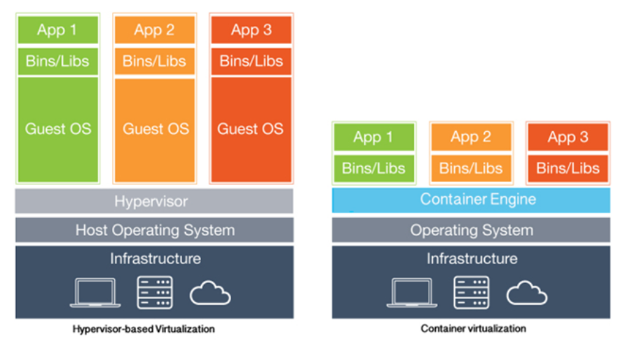
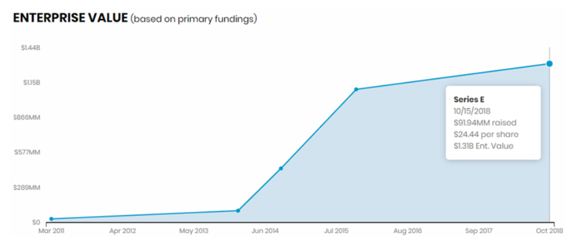
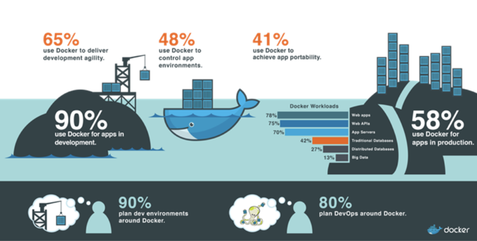

참고 : https://mangkyu.tistory.com/86

# ------------------------------------------

# 1. 가상화(Virtualization)란?

가상화란 관리자 역할을 맞은 소프트웨어(주로 hypervisor)를 이용하여 하나의 물리적 머신에서 가상머신(VM)을 만드는 프로세스를 이야기한다. 

hypervisor는 가상화 층을 구현하여 물리적 머신의 컴퓨팅 리소스로부터 가상 환경을 분리하고 가상 머신(VM)을 생성한다. VM은 물리적 머신과 동일한 역할 및 성능을 수행하지만, CPU와 메모리 및 스토리지와 같은 물리적 머신의 컴퓨팅 리소스를 사용한다. Hypervisor는 필요에 따라 각 VM에 이러한 컴퓨팅 리소스를 할당한다.

## 1) 가상화 예시

가상화를 이용하면 서버를 통합(Server Consolidation) 하고 서버의 자원을 최대한으로 활용함으로써 서버 급증 문제(Server Proliferation Problem)를 해겨할 수 있다.

예를 들어, 용도가 다른 3개의 물리 서버가 있다고 가정하자. 1개는 메일서버이고, 다른 1개는 웹 서버이고, 다른 1개는 내무 레거시 애플리케이션을 실행하는 서버이다. 각 서버는 잠재적인 실행 용량의 30%만 사용되고 있지만, 내부 운영을 위해 레거시 애플리케이션이 계속 필요하므로, 레거시 애플리케이션과 이를 호스팅하는 또 다른 3번째 서버를 유지해야 한다.

전통적으로 1개의 서버에 설치된 1개의 OS 위에 1개의 태스크를 수행하도록 하는 것이 더 쉽고 안정적인 경우가 많다. 하지만 이러한 경우 각각의 서버가 자원을 최대한으로 활용하지 않기 때문에 서버 전력비가 비효율적으로 발생하며, 각각의 서버가 서로 다른 공간에 위치하므로 공간 대여 비용도 발생하는 등 각각의 서버를 최대한으로 활용하지 못하고 있다.

그러나 가상화를 사용하면 기존의 메일 서버를 2개로 분리하여 1개의 서버로는 메일을 처리하고, 1개의 서버로는 레거시 애플리케이션을 마이그레이션 할 수 있다.

또한 메일서버를 만약 3개로 분리한다면, 메일 서버의 자원을 최대한으로 활용하고, 남은 2개의 서버는 다른 태스크를 처리하거나 사용을 중지하여 냉각 및 유지 관리 비용을 줄일 수 있다.

------

# 2. 가상화의 장점

## 1) 비가상화

- 1개의 OS가 모든 하드웨어 자원을 관리한다.
- 1개의 머신에서 여러 개의 애플리케이션을 구동하는 것은 충돌 등의 문제를 발생시킬 수 있다.
- 유연하지 못하며, 인프라 비용이 높아질 수 있다.

## 2) 가상화

- 1개의 하드웨어 상에서 여러 개의 가상머신(VM)을 구동할 수 있다.
- 하드웨어와 무관하게 원하는 운영체제나 그에 맞는 애플리케이션을 실행할 수 있다.
- 어떠한 시스템에서도 가상 머신이 프로비저닝 될 수 있다.

## 3) 가상화의 장점

- Server Consolidation : 물리적인 서버의 개수를 줄여 1개의 서버로 통합함으로써 서버의 전력 및 냉각 비용, 하드웨어 공간 비용 등을 줄일 수 있다.
- Isolation : 기능에 맞게 여러 개의 머신으로 분리하여 Failures나 Security Leaks 등에 더욱 잘 대처할 수 있다.
- Efficiency : 컴퓨팅 자원의 사용을 최대화하고 보다 쉽게 관리 할 수 있다.
- Flexibility : 한 서버의 데이터를 마이그레이션하기에 용이해진다.

위의 내용 외에도 가상화를 통해 동일한 머신에서 다양한 유형의 앱, 데스크탑 및 운영체제를 실행할 수 있거나 새로운 애플리케이션을 프로비저닝 하는데 걸리는 시간을 줄일 수 있다는 여러 장점이 있다.

## 4) 클라우드 컴퓨팅에서 가상화의 역할

클라우드 컴퓨팅은 인터넷을 통해 공유 컴퓨팅 리소스, 소프트웨어 또는 데이터를 제공하는 방식이다. 사용자는 클라우드를 통해 컴퓨터의 자원을 Transparent하게 사용할 수 있다. 

가상화는 클라우드 컴퓨팅을 가능하게 하는 주요 기술 중 하나로, 클라우드 공급업체는 가상화를 사용하기 때문에 하나의 서버에서 여러 고객에게 서비스를 제공할 수 있다. 많은 기업들은 가상화 및 클라우드 컴퓨팅을 모두 사용하여 효율성을 극대화 하고 있다.

------

# 3. 하드웨어 가상화의 종류

## 1) 가상화의 종류

가상화에도 서버 가상화, OS-Level 가상화, 데스크톱 가상화, 애플리케이션 가상화, 네트워크 가상화 등이 있다. 그 중에서도 서버를 가상화하는 하드웨어 가상화인 전가상화와 반가상화의 차이에 대해서 설명하겠다.

### (1) CPU의 동작 레벨

서버를 가상화하는 하드웨어 가상화인 전가상화와 반가상화의 차이에 대해 이해하기 위해서는 CPU의 동작 레벨에 대해서 알고 있어야 한다.

OS에서 구동되는 소프트웨어는 보안을 위해 권한과 보호 수전에 따라 링(RING) 등급으로 나뉘어진다.

- Ring 0를 특권 모드하고 하며 시스템 자원을 관리하는 OS 커널이 동작한다.
- Ring 1, 2는 예약된 상태로, 평상시에는 사용되지 않는다.
- Ring 3는 우리가 일반적으로 사용하는 응용프로그램들이 동작한다.

## 2) 전가상화(Full Virtualization)

### (1) 전가상화

전가상화란 호스트 CPU의 가상화 기술을 이용하여 전체 하드웨어를 완전히 가상화하는 기술이다. 여기서 하드웨어를 완전히 가상화한다는 것은 게스트 OS가 자신이 가상화 환경인지 모르는 상태를 의미하며, 그에 따라 가상화되지 않은 실제 하드웨어 명령을 직접 요청하는 것처럼 동작한다.

전가상화를 하면 root 모드와 non-root 모드가 생기게 되는데, 하이퍼 바이저가 root 모드, 운영체제 및 애플리케이션과 같은 도메인이 non-root 모드에 해당된다. 이러한 구조에서 만약 게스트 OS가 특권 명령(Privileged Instruction)을 처리해야 하는 상황이 오면 전가상화는 Trap & Emulate 방식으로 처리를 해준다.

- 정의 : 하드웨어를 완전히 가상화하는 방식으로, 게스트 OS에 아무런 수정 없이 다양한 OS를 이용 가능
- 전제 조건 : CPU의 Intel-VT나 AMD-V 등의 물리적인 가상화 지원 기능이 있어야 함
- 단점 : Trap & Emulate 으로 인한 성능 저하 발생

### (2) Trap & Emulate

Trap 이란 특권 명령을 실행할 권한이 없는 비특권 모드(게스트 OS)에서 특권 명령을 실행할 때 시스템에 발생하는 예외 또는 결함이다. 예를 들어 0으로 나누기(divide by zero)나 디버깅을 위한 중단점(break point)과 같은 처리를 하면 프로그램의 제어권이 트랩 사건을 처리하는 트랩 핸들러로 넘어가게 된다.

전 가상화에서 게스트 OS가 특권 명령을 실행하려고 한다면 Trap & Emulate 방식으로 처리해준다.

Trap & Emulate는 다음과 같이 진행된다.

1. 비특권 모드인 게스트 OS에서 특권 명령을 수행하려 한다.
2. 게스트 OS는 트랩상태(trap state)로 바뀌게 되고, 트랩 핸들러는 VM exit을 통해 제어권을 VMM(Hypervisor)로 넘겨준다.
3. Hypervisor는 해당 명령을 처리한다.(Emulate)
4. 해당 명령의 처리가 끝나면 VM enter을 통해 실행 결과와 함께 제어권을 운영체제로 넘겨준다.

이러한 방식으로 Trap을 처리할 수 있지만 Trap 자체가 발생하여 게스트 OS의 실행이 중단되는 등 여러 현상들이 시스템 오버헤드를 크게 일으킨다. 또한 x86 아키텍처는 약 17개가량의 특권 명령과 비특권 명령의 경계가 모호한 명령어들이 존재하여 Trap & Emulate 방식만으로 하이퍼바이저를 구현하는 것은 어렵다고 한다. 따라서 이러한 문제를 극복하고자 전가상화를 위한 Binary Translation이 등장하게 되었다.

### (3) Binary Translation(이진 변환)

Trap & Emulate 방식의 단점을 해결하기 위해 VMware에서는 이진 변환(binary translation)이라는 기술을 선보였다. 이진 변환이란 게스트 OS에서 특권 명령을 수행하려고 할 때 하이퍼바이저가 바이너리 연산을 통해서 하드웨어가 인식할 수 있는 명령어로 변환하여 전달하는 기법이다. 이진 변환이란 CPU에서 직접 실행하는 방식이지만 중간에 하이퍼바이저가 번역하는 과정이 추가되었다. 이러한 방법은 개발하기가 상당히 까다롭다는 단점이 있었다. 

VMware가 선보인 이진 변환이라는 기술과 다르게 Xen은 Hypercall이라는 방법을 제안했는데, 반가상화라는 대비되는 명칭을 갖게 되었다.

# ------------------------------------------

참고 : https://m.blog.naver.com/shakey7/221600166205

# 1 컨테이너(container) 란?

- 컨테이너라는 개념은 2000년대 중반 리눅스에 내장된 LinuX Container( LXC ) 기술로부터 처음 소개되기 시작. LXC는 단일 머신상에서 여러 개의 독립된 리눅스 커널 컨테이너를 실행하기 위한 OS 레벨의 가상화 기법으로 컨테이너 개념의 시초이다.

- 네트워크, 스토리지, 보안 등 각 영역마다 정책이 서로 다르기 때문에 컴퓨터 프로그램들은 환경이 바뀔 때마다 각종 오류가 발생했다. 이는 소프트웨어 개발자들의 오랜 골칫거리로 이를 해결하기 위해 현재의 컴퓨팅 환경에서 다른 환경으로 이동하더라도 안정적으로 프로그램을 실행되게 하려고 나온 개념이 바로 컨테이너 이다.

## 1) 컨테이너 개념 및 구조

- 컨테이너는 모듈화 되고 격리된 컴퓨팅 공간 또는 컴퓨팅 환경, 다시 말해 어플리케이션을 구동하는 환경을 격리한 공간을 의미한다.

- 기본적으로 가상화를 위해 하이퍼바이저와 게스트OS가 필요했던 것과는 달리, 컨테이너는 운영체제를 제외하고 어플리케이션 실행에 필요한 모든 파일만을 패키징(Packaging) 한 형태이다. 그만큰 기존의 가상머신에 비해 가볍고 빠르게 동작이 가능하다.

- "운영체제의 커널(kernel)"이 여러 격리된 사용자 공간 인스턴스를 갖출 수 있도록 하는 가상화 방식이기 때문에 "OS 레벨 가상화" 라고 불린다.
  - 커널 : 운영 체제의 핵심이 되는 컴퓨터 프로그램, 운영 체제의 다른 부분 및 응용 프로그램 수행에 필요한 여러 서비스를 제공하는 역할을 하며, 메모리나 저장장치 내에서 운영 체제의 주소 공간을 관리한다.

- 어플리케이션의 실행에 필요한 라이브러리(Library, Libs), 바이너리(Binary, Bins), 기타 구성 파일 등을 패키지로 묶어서 배포하는 방식으로 구동환경이 바뀌어도 실행에 필요한 파일이 함께 따라다니기 때문에 오류를 최소화할 수 있다.
  - 라이브러리 : 프로그램 구동 시에 필요하거나 공통으로 사용할 수 있는 특정 기능의 서브프로그램 또는 소스 코드 집합을 의미. 라이브러리에는 주로 함수(서브루틴), 클래스에 대한 정의, 구성 데이터 등 미리 작성된 코드를 포함
  - 바이너리 : 컴퓨터 저장과 처리 목적을 위해 이진수 형식으로 인코딩된 데이터 파일을 의미하는 것으로 코드의 컴파일(Compile) 또는 압축된 결과물

# 2 컨테이너 기술의 특성

## 1) 경량화

- 기존의 서버에 하이퍼바이저를 설치하고, 그 위에 가상 OS(게스트 OS)와 앱을 패키징한 VM을 만들어 실행하는 방식인  '하드웨어 레벨'의 가상화와는 달리 컨테이너는 게스트 OS와 하이퍼바이저가 없는 'OS 레벨' 가상화 구조이기 때문에 시스템에 대한 요구사항이 적음
- 기존 VM에는 게스트 OS가 포함되므로 크기가 수 GB를 넘고, 각각의 게스트 OS마다 운영 체제 구동에 필요한 하드웨어의 가상 복제본(CPU, RAM 등)을 모두 구동해야 하기 때문에 시스템 자원 또한 많이 소모하지만 컨테이너에는 OS가 포함되지 않아 크기가 수십 MB에 불과하며 운영체제 부팅이 필요하지 않아 서비스 시작 시간 또한 매우 빠름고 또한 가볍기 때문에 컨테이너에 대한 복제와 배포가 용이하다 
- 컨테이너는 더 많은 응용프로그램을 더 쉽게 하나의 물리적 서버에 구동시키는 것이 가능하기 때문에 마이크로 서비스 구축에 최적이다.

## 2) 컴퓨팅 자원

- 컨테이너는 생성 및 실행되면 마치 운영체제 위에서 하나의 어플리케이션이 동작하는 것과 동일한 수준의 컴퓨팅 자원만을 필요로 하기 때문에 기존의 가상머신 방식 대비 시스템의 성능 부하가 훨씬 적은 편이다.
- 컨테이너에서 실행중인 서비스에 더 많은 가용성이 필요하거나 반대로 필요 없을 때 , CPU 사용량 또는 사용자가 설정한 임계치에 따라 자동으로 확장 및 축소가 가능하다.

## 3) 구동 방식

- 컨텐이너는 특정 클라우드 어플리케이션이 실행되기 위한 모든 라이브러리와 바이너리 파일 등이 패키지화 되어 있기 때문에 기존의 시스템에서 실행하는 식으로 구동 방식이 간단하다. 반면, 가상머신 방식은 특정 어플리케이션을 실행하기 위해 먼저 새로운 VM을 띄우고 자원을 할당한 다음, 필요한 게스트 OS를 부팅한 후 어플리케이션을 실행시켜야 한다.

## 4) 안정성

- 컨테이너 기술은 위와 같은 여러 장점이 있지만 안정성에 있어서는 우려되는 부분이 존재한다.
- 가상머신 방식은 VM들이 각각 독립된 형태로 완전치 분리되어 있기 때문에 안정적인 운영이 가능하지만, 컨테이너 방식은 비록 통제된 영역이라 할지라도 호스트 OS 커널을 공유하는 구조이기 때문에 한쪽에서 장애가 발생하면 다른 컨테이너들 또한 영향을 받을 수 있다.

# 3 컨테이너 사례 : 도커 (Docker)

## 1) 도커란?

- 오픈소스 기반의 컨테이너 관리 플랫폼
- 완전히 새로운 기술이 아닌, 이미 존재하는 기술들을 잘 엮어냈다는 점이 포인트이다. 컨테이너, 오버레이 네트워크, 유니온 파일 시스템 등 기존에 존재하던 기술들을 잘 조합하여 사용자들이 원하는 기능을 간단하지만 획기적으로 구현했다.
  - 오버레이 네트워크 : 물리 네트워크 위에 생성한 가상의 네트워크
  - 유니온 파일 시스템 : 읽기 전용의 파일을 수정할 때 쓰기가 가능한 임시파일을 생성하고 수정이 완료되면 기존의 읽기전용 파일을 대체하는 형식의 파일 시스템

## 2) 도커 기술 특성

- 도커는 리눅스의 응용프로그램들을 소프트웨어 컨테이너 안에 배치시키는 일을 자동화하는 오픈소스 프로젝트로 리눅스 컨테이너 기술 기반이다.
- 기존 리눅스 컨테이너 기술보다 이식성을 향상시키고, 데이터와 코드의 분산된 관리, 프로그램 스택의 간결 명료함 등 이동성과 유연성을 높였다. 기존시스템보다 더 쉽고 빠르게 워크로드를 배포 및 복제하고 이동할 수 있으며 백업도 가능하다.
- 컨테이너 이미지 생성 기능을 통해 특정 컨테이너에서 실행될 소프트웨어와 방식에 대해서 컨테이너 실행에 필요한 파일, 설정값 등의 구동 사양을 미리 정의해 놓을 수 있다
- 도커 이미지를 활용하여 개발자는 어플리케이션의 이미지를 만들고, 환경에 구애 받지 않은 채 원격으로 배포하여 실행하는 것이 가능해졌다. 이로 인해 고도의 분산 시스템을 생서하는 일이 단순해짐으로써 개발자가 하나하나 데이터 센터의 서버를 찾아 다니면서 하나씩 세팅할 필요가 없어졌다.
- 컨테이너에서 실행되는 앱과 구동하는 시스템이 분리된 형태로 있기 때문에 더 깔끔한 소프트웨어 스택 구현이 가능하다.

## 3) 도커 이미지

### (1) 이미지 (Image)

- 도커에서 가장 중요한 개념은 컨테이너와 이미지 이미지란 컨테이너 실행에 필요한 파일과 설정값 등을 포함하고 있는 파일을 의미한다.
- 예를 들어, 우분투(ubuntu) 이미지는 우분투 OS를 실행하기 위한 모든 파일을 가지고 있고, MySQL 이미지는 데비안(Debian) OS를 기반으로 MySQL을 실행하는데 필요한 파일과 실행 명령어, 포트 정보 등을 가지고 있다.

### (2)

### (3)

