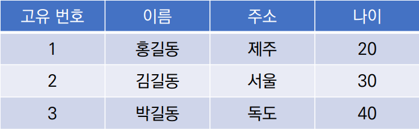
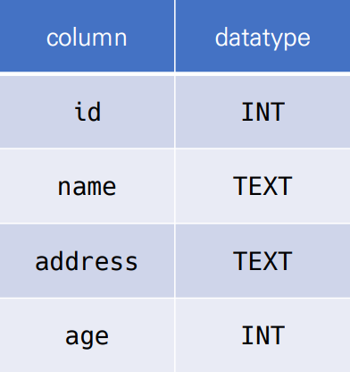
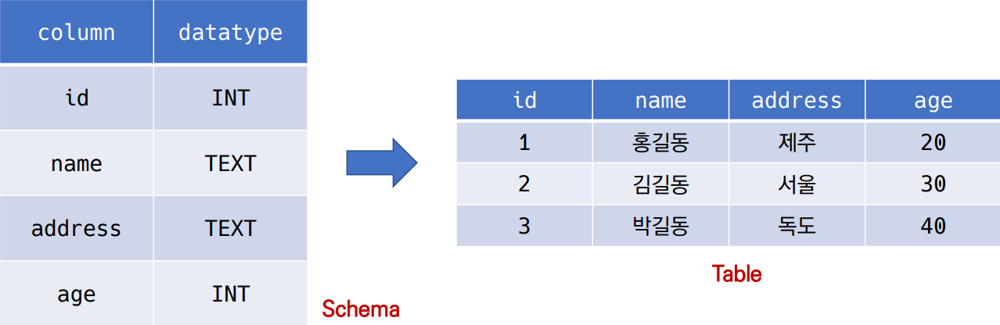
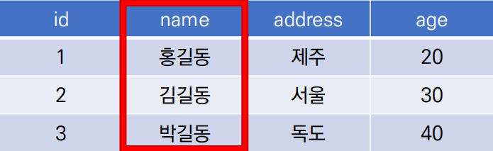
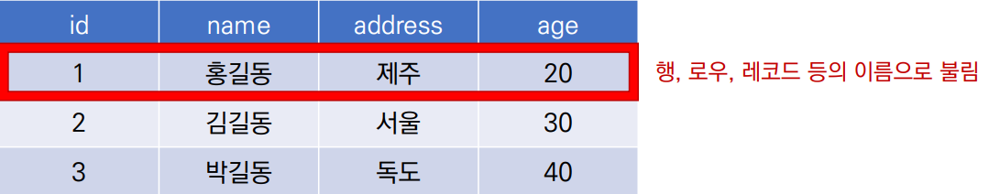
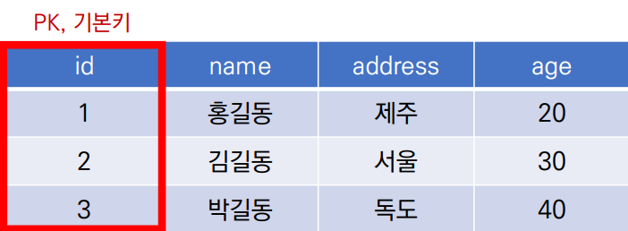
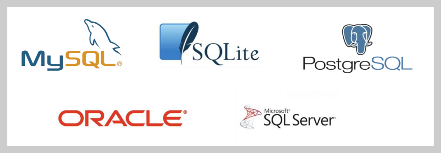
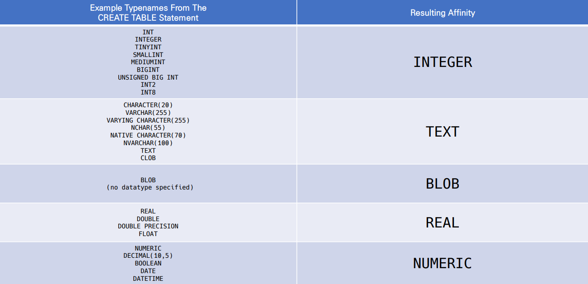

---

# Database

- 체계화된 데이터의 모임
- 논리적으로 연관된 자료의 모음
- 몇 개의 자료 파일을 조직적으로 통합하여 자료 항목의 중복을 줄이고 자료를 구조화하여 기억시켜 놓은 자료의 집합체

## - DB의 장점

- 중복 최소화
- 무결성(정확한 정보를 보장)
- 일관성
- 독립성(물리적, 논리적)
- 표준화
- 보안

------

# Relational DataBase

## - 관계형 데이터베이스 RDB(Relational DataBase)

- 서로 관련된 데이터를 저장하고 접근할 수 있는 데이터베이스 유형
- key와 value들의 간단한 relation을 table 형태로 정리한 데이터베이스

## - 스키마(Schema)

- DB에서 자료의 구조, 표현방법, 관계등 전반적인 명세를 기술한 것

## - 테이블(table)

- 열(컬럼, 필드)과 행(레코드, 값)의 모델을 사용해 조직된 데이터 요소들의 집합

## - 열(column) : 각 열에 고유한 데이터 형식 지정

ex) name 이라는 필드에 고객의 이름(Text)가 저장

## - 행(row) : 실제 데이터가 저장되는 형태

ex) 총 3개의 레코드가 있다.

## - 기본키 (Primary Key) : 각 행(레코드)의 고유 값

- 반드시 설정해야 함, DB 관리 및 관계 설정 시 주요하게 활용

------

# RDBMS

## - 관계형 데이터베이스 관리 시스템 (RDBMS)

- 관계형 모델을 기반으로 하는 데이터베이스 관리시스템을 의미

## - SQLite

- 서버 형태가 아닌 파일 형식으로 응용 프로그램에 넣어서 사용하는 비교적 가벼운 데이터베이스
- 구글 안드로이드 운영체제에 기본적으로 탑재된 데이터베이스이며, 임베디드 소프트웨어에도 많이 사용
- 로컬에서 간단한 DB를 구성할 수 있으며, 오픈소스 프로젝트이기 때문에 자유롭게 사용가능

## - SQLite Data Type

- NULL
- INTEGER
  - 크기에 따라 0, 1, 2, 3, 4, 6 또는 8바이트 저장된 부호 있는 정수
- REAL
  - 8바이트 부동 소수점 숫자로 저장된 부동 소수점 값
- TEXT
- BLOB
  - 입력된 그대로 정확히 저장된 데이터 (별다른 타입 없이 그대로 저장)

## - 특정 컬럼에 저장하도록 권장하는 데이터 타입

- INTEGER
- TEXT
- BLOB
- REAL
- NUMERIC

