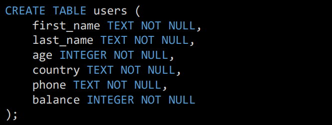
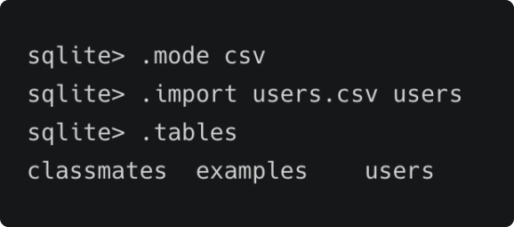

------

# WHERE

- CREATE TABLE

- csv파일 정보를 테이블에 적용하기

- 특정 조건을 가지고 데이터 조회하기

## - WHERE 절에서 사용할 수 있는 연산자

- 비교 연산자
  - 숫자 혹은 문자 값의 대소, 동일 여부를 확인한다.
  - =, <, <=, >, >=
- 논리 연산자
  - AND
    - 앞에 있는 조건과 뒤에 오는 조건이 모두 참인 경우
  - OR
    - 앞의 조건이나 뒤의 조건이 참인 경우
  - NOT
    - 뒤에 오는 조건의 결과를 반대로
- 부정 연산자

- BETWEEN 값1 AND 값2
  - 값1과 값2 사이의 비교
    - age BETWEEN 20 AND 30;
    - 위는 20 <= age <= 30 이러한 조건과 같다.
- IN(값1, 값2)
  - 목록 중에 값이 하나라도 일치하면
- LIKE
  - 비교 문자열과 형태가 일치 하는가
  - 와일드 카드 ("%" : 0개 이상의 문자, "_" : 1개의 단일 문자)
- IS NULL / IS NOT NULL
  - null 여부를 확인할 때는 항상 = 대신에 IS 를 사용한다.
- 연산자 우선순위
  - 1순위 : 괄호
  - 2순위 : NOT
  - 3순위 : 비교 연산자, SQL
  - 4순위 : AND
  - 5순위 : OR

------

# SQLite Aggregate Functions

## - Aggregate Function (집계 함수)

- 값 집합에 대한 계산을 수행하고 단일 값을 반환
- SELECT 구문에서만 사용

#### - 예시

- COUNT(컬럼)
  - 그룹의 항목 수를 가져옴
- AVG(컬럼)
  - 모든 값의 평균을 계산
- MAX(컬럼)
  - 그룹에 있는 모든 값의 최대값을 가져옴
- MIN(컬럼)
  - 그룹에 있는 모든 값의 최소값을 가져옴
- SUM(컬럼)
  - 모든 값의 합을 계산

------

# LIKE

- 패턴 일치를 기반으로 데이터를 조회하는 방법
- SQLite 는 패턴 구성을 위한 2개의 wildcards를 제공한다.
  - %
    - 0개 이상의 문자
    - 이 자리에 문자열이 있을 수도, 없을 수도 있다.
  - _
    - 임의의 단일 문자
    - 반드시 이 자리에 한 개의 문자가 존재해야 한다.

 

------

# ORDER BY

- 조회 결과 집합을 정렬한다.
- 정렬 순서를 결정하기 위한 2개의 keyword를 제공
  - ASC(default 값) : 오름차순
  - DESC : 내림차순

#  
