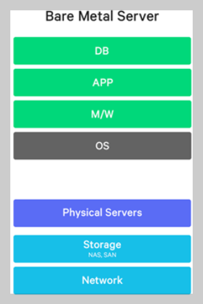
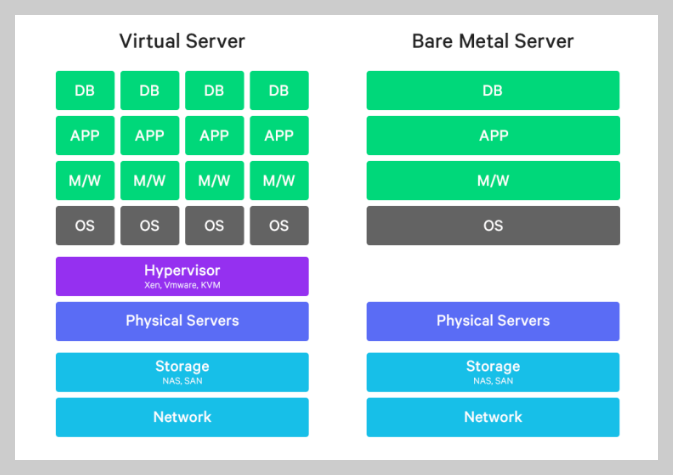
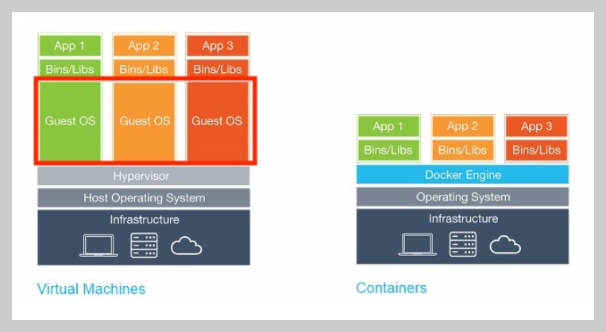
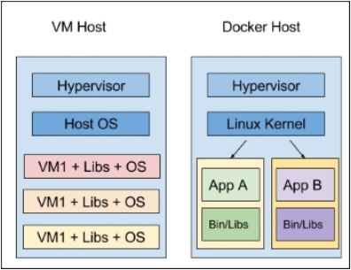
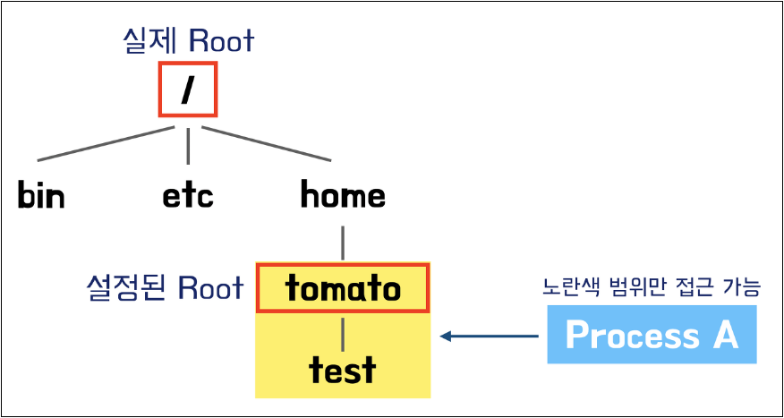
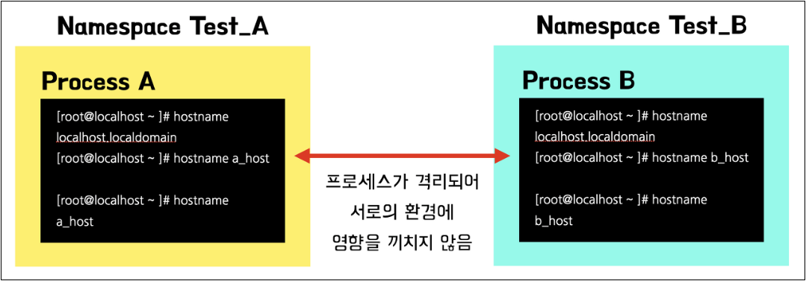
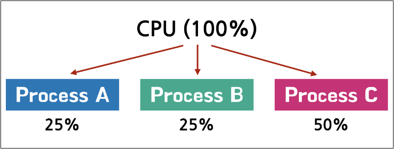

------

https://www.youtube.com/watch?v=3HId-tpYaZs&list=PLApuRlvrZKogb78kKq1wRvrjg1VMwYrvi&index=4

------

# 컨테이너를 배우는 이유

## - 시대의 흐름

https://m.blog.naver.com/n_cloudplatform/221212685823

[https://velog.io/@kdaeyeop/%EB%8F%84%EC%BB%A4-Docker-%EC%99%80-VM%EC%9D%98-%EC%B0%A8%EC%9D%B4](https://velog.io/@kdaeyeop/도커-Docker-와-VM의-차이)

### - Bare Metal

- 금속 뼈대가 다 드러난 상태, 그저 쇳덩이 상태
- IT 업계에서는 "어떤 소프트웨어도 담겨 있지 않은 하드웨어"
- 하드웨어에 대한 직접 제어 및 OS 설정도 가능
- 우리가 아는 일반적인 "서버 컴퓨터", "컴퓨터 노드"

### - Virtualization

- 물리적인 컴퓨터 리소스의 특징을 다른 시스템, 응용 프로그램, 최종 사용자들이 리소스와 상호작용하는 방식으로부터 감추는 기술
- 하나의 물리적 리소스 위에서 여러 OS를 동시에 실행할 수 있도록 하는 것

### - Container 중 하나인 Docker

- 컨테이너도 VM과 무척 유사하지만 간단한 차이를 이야기 하자면 게스트 OS의 유무가 있다.
- 도커는 자체적으로 컨테이너 엔진 이라는 것을 서버OS 위에 올려 자원을 관리하여 게스트 OS가 따로 필요하지 않다.
- 도커는 어플리케이션을 구동하는데 필요한 모든 패키지만 있으면 돌릴 수 있어서 용량이 적게 들고 격리된 환경이기 때문에 배포가 쉽고 확장성이 좋다는 장점이 있다.

------

# 리눅스에서 돌려야 하는 이유

## - 리눅스 커널 기능을 써야 해서

https://tomatohj.tistory.com/39

### - chroot

- 프로세스에 대해 새로운 root 디렉토리를 지정
- 프로세스는 새로운 root 디렉토리 하위로만 접근이 가능하다.
- 프로세스에 대한 파일시스템을 격리한다.(시스템 설정, 환경은 동일하다.)

### - namespace

- 프로세스별 리소스 사용을 분리하는 것
- 서로 다른 namespace에 존재하는 프로세스들을 리소스 관리를 따로 한다.
- 프로세스에 대한 환경을 격리한다. (하드웨어 자원에 대한 분리를 수행하지는 않는다.)

### - cgroup

- 프로세스 별 가용 컴퓨팅 자원 제어(메모리, cpu, device, disk I/O 등)

## - 리눅스가 아니라면 Hypervisor 사용

- 리눅스가 아닌 OS에서는 Hypervisor를 활성화 하여 Docker를 사용할 수 있다.