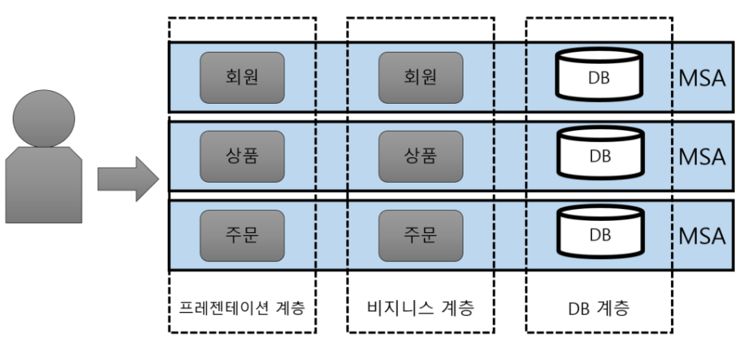
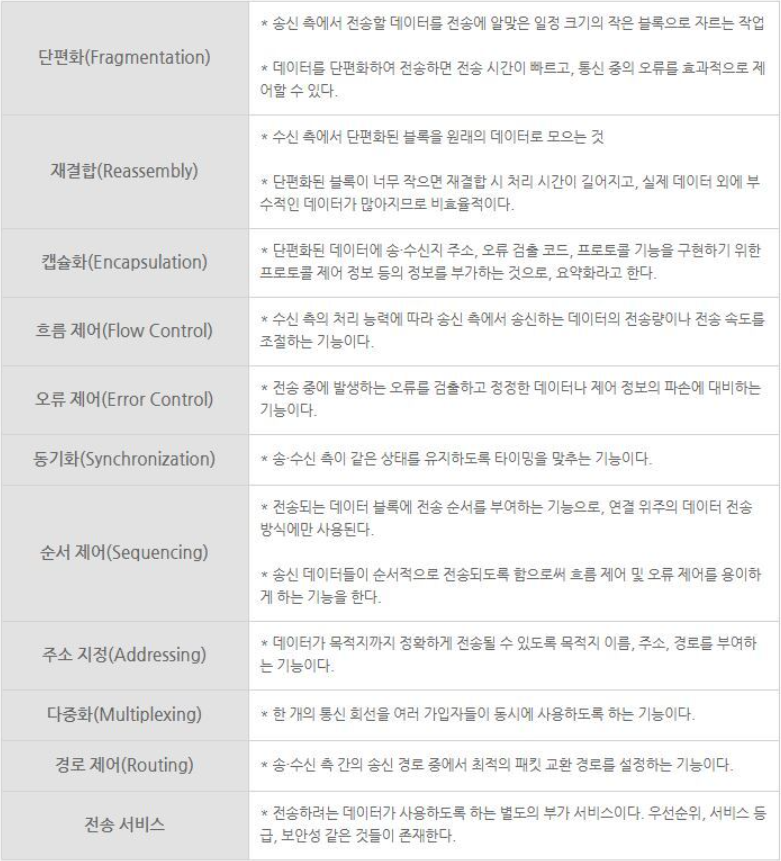
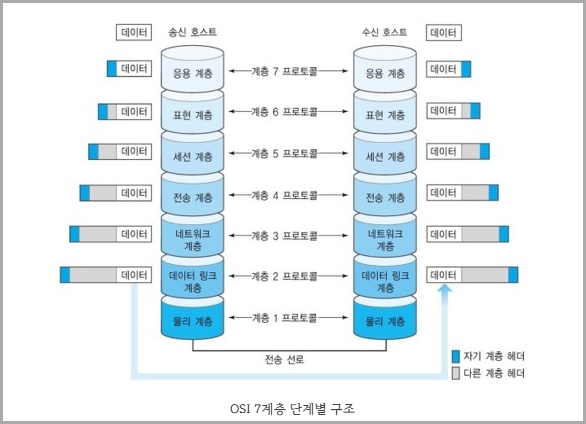
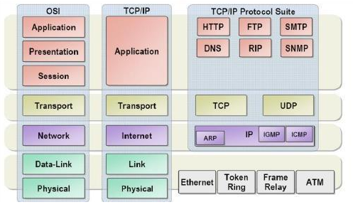

# 12.29

# MSA란 무엇인가 / MSA의 장점

## MSA 이전 Monolithic Architecture

### 특징

- 전통적인 방식의 개발방법
- monolithic
  - 하나의 암석으로 된
  - 단일체의 , 한 덩어리로 뭉친
- 한 덩어리의 구조를 가진 서비스들

### 장점

- 한 덩어리의 구조
- 하나의 서비스가 모두 동일한 개발 툴을 이용
- 배포 및 테스트가 하나의 어플리케이션으로 수행 가능하여 개발, 환경설정이 용이

### 단점

- 규모가 작은 서비스에서는 용이하지만 점점 커지면서 단점들이 부각될 수 있음
- 빌드 / 테스트 시간이 길어진다
  - 작은 부분의 빌드/테스트에도 전체를 끄고 건드려야한다.
- 선택적인 확장이 불가하다
  - 특정 부분의 서버, 혹은 데이터만 조정하고 싶어도 전체를 다뤄야 한다.
- 부분이 전체에 영향을 준다.
  - 일부분의 문제가 생겨도 전체가 꺼진다.

## Micro Service Architecture

### 특징

- 핫?? 많이 이용하는 개발 방법
- micro
  - 아주 작은것
  - 미시, 미세
- micro 단위로 나뉘어진 독립적 service들을 연결한 구조
- 복잡한 웹 시스템에 적절한 스타일

### 장점

- micro 단위로 나위어져 있어 **독립적**으로 업데이트, 조정이 가능하다.
  - 독립적 업데이트, 배포가능
  - 부분적 확장 가능 (트레픽이 집중되는 부분만 확장가능)
- 데이터 분리
  - DB의 종류를 별도로 사용가능하고, 같은 DB라도 나눠서 사용한다.

### 단점

- 각각의 서비스간 API통신을 이용하기 때문에 mono구조에 비해 속도가 느리다.
- 통신에 사용하기 위한 데이터들이 오버헤드를 발생시키기도한다.

## 참고

- http://clipsoft.co.kr/wp/blog/%EB%A7%88%EC%9D%B4%ED%81%AC%EB%A1%9C%EC%84%9C%EB%B9%84%EC%8A%A4-%EC%95%84%ED%82%A4%ED%85%8D%EC%B2%98msa-%EA%B0%9C%EB%85%90/

- https://www.opsnow.com/%EC%9A%94%EC%A6%98-%EB%8C%80%EC%84%B8-msa/

# 프로토콜의 개념, 요소, 특징, 계층 구성

## 개념

- Protocol
  - (통신)규약
- 데이터의 교환을 원활하게 수행할 수 있도록 표준화 시켜놓은 통신 규약
- 네트워크에서의 프로토콜은 단순히 둘 이상의 통신 개체 간에 교환되는 메시지 포맷과 순서뿐 아니라 메시지의 송수신과 다른 이벤트에 따른 행동들을 정의한다.

## 요소

3가지의 기본요소가 존재

- 구문( Syntax )
  - 전송하려는 데이터의 형식, 부호화, 신호레벨 등을 규정
- 의미( Semantics )
  - 상호 효율적이고 정확한 정보 전송을 휘한 협조사항과 오류관리를 위한 제어정보를 규정
- 시간( Timing )
  - 상호 통신속도, 메시지의 순서 제어 등을 규정

## 특징, 기능

## 계층 구성 (OSI 7 Layer)

OSI(Open System Interconnection) 7 Layer 는 ISO(International Organization for Standardization, 국제표준기구)에서 만든 계층간 네트워크 통신을 위해 만든 규약을 이야기한다.

우리가 어떤 데이터를 전송한다면 최상위 계층인 응용 계층에서 최하위 계층인 물리 계층까지 지나가면서 각 계층마다 데이터가 처리되면서 전송 매체에게 데이터가 전달된다. (단편화 과정)

### 1계층 물리(Physical Layer)

- 실제 장치를 연결하기 위한 전기적, 물리적 세부 사항을 정의한 계층으로 인터넷 케이블, 라우터 스위치 등 물리적 장치에 의해 통신하는 계층
- 여기서는 단지 데이터를 전달만 할 뿐 전송하려는 혹 받으려는 데이터가 무엇인지, 에러가 있는지 등에는 전혀 신경 쓰지 않고 데이터를 전기적 신호로 변환해서 주고받는 기능만 한다.

### 2계층 데이터 링크(Data Link Layer)

- 장치 간 신호를 전달하는 물리계층(1계층)을 이용하여 네트워크 상의 주변 장치들 간 데이터를 전송하는 역할을 한다.
- 물리계층을 통해 송수신되는 정보의 오류와 흐름을 관리하여 안전한 정보의 전달을 수행, 통신간의 오류도 찾고, 재전송하는 기능을 가지고 있으며 신뢰성 있는 전송을 보장하기 위한 계층
- 전송되는 데이터의 단위를 프레임 이라고 하고 브리지, 스위치 등의 장비를 사용한다.

### 3계층 네트워크(Network Layer)

- 여러 개의 노드를 거칠 때마다 경로를 찾아주는 역할을 하는 계층으로 다양한 길이의 데이터를 네트워크들을 이용하여 전달하고, 전송 계층에서 요구하는 서비스 품질(QoS)을 제공하기 위한 기능적, 절차적 수단을 제공한다.
- 주소를 정하고 경로를 선택하고, 그에 따라 패킷을 전달해주는 역할을 한다.
- 테이터를 목적지까지 가장 안전하고 빠르게 전달하는 기능(라우팅)이 핵심이다.

### 4계층 전송(Transport Layer)

- 통신을 활성화하기 위한 계층, 보통 TCP 프로토콜을 이용하며, 포트를 열어서 응용프로그램들이 전송을 할 수 있게 한다.
- 데이터들을 통합하여 다음 계층으로 전달
- 종단 간(end-to-end) 통신을 다루는 최하위 계층으로 종단 간 신뢰성 있고 효율적인 데이터를 전송하며, 기능은 오류 검출 및 복구와 흐름 제어, 중복검사 등을 수행한다.

### 5계층 세션(Session Layer)

- 양 끝단의 응용 프로세스가 통신을 관리하는 방법을 제공

- 통신 연결이 손실되는 경우 연결 복구 시도가 가능하며 연결 시도중 장시간 연결이 되지 않았다면 세션 계층의 프로토콜이 연결을 닫고 다시 연결을 시도

  

### 6계층 표현(Presentation Layer)

- 코드 간 번역을 담당하는 계층

### 7계층 데이터 링크

## 참고

- https://sorjfkrh5078.tistory.com/59
- https://onecoin-life.com/19