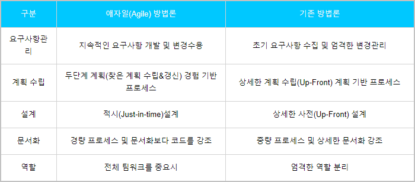
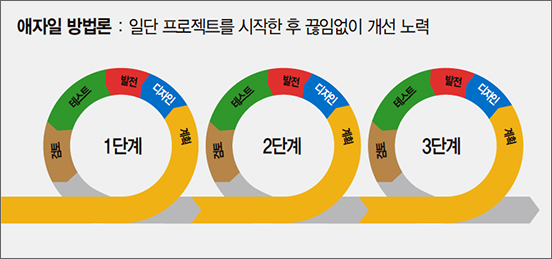
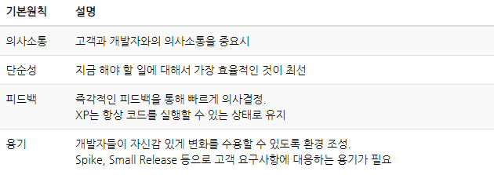
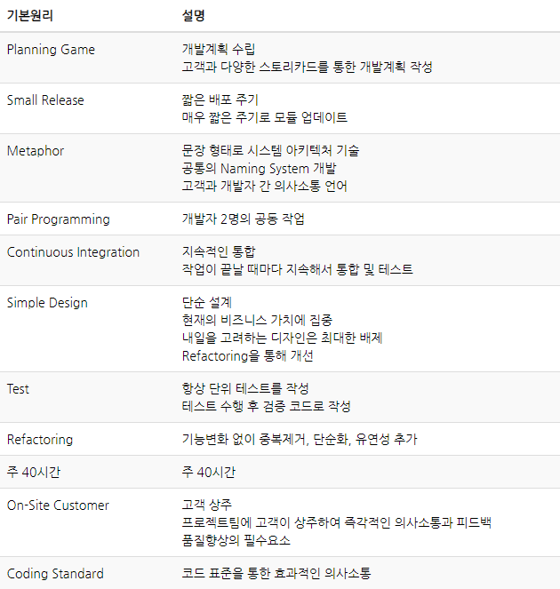

# 애자일이란?

# 참고

http://www.incodom.kr/%EC%95%A0%EC%9E%90%EC%9D%BC_%EB%B0%A9%EB%B2%95%EB%A1%A0#h_e9f47b8b07d396ffa1edcf276b9e533b

https://ko.wikipedia.org/wiki/%EC%95%A0%EC%9E%90%EC%9D%BC_%EC%86%8C%ED%94%84%ED%8A%B8%EC%9B%A8%EC%96%B4_%EA%B0%9C%EB%B0%9C#%EA%B0%9C%EB%B0%9C_%EB%B0%B0%EA%B2%BD

https://m.blog.naver.com/sundooedu/221193074730

-----------------------------

# 개념

> Agile = '기민한, 날렵한' 이라는 뜻으로 애자일 방법론이란, 좋은 것은 빠르게 취하고, 낭비를 최소한으로 개발하는 다양한 방법론을 통칭하는 말이다. 앞을 예측하며 개발하는 것이 아니라, 일정한 주기를 가지고 계속해서 검토해 나가며 필요할 때마다 요구사항을 더하고 수정하며 커다랗게 살을 붙이면서 개발하는 프로세스를 거친다.

---

# 탄생 배경

애자일 방법론의 발전은 소프트웨어 개발이 다른 공학적인 프로세스들과 큰 차이가 있다는 것을 인지하면서 시작 되었다.

90년대 후반까지 소프트웨어 공학의 개발방법론은 장기간 많은 사람들을 동원하여 충분한 비용을 가지고 개발하는 여타 다른 공학적 프로세스들과 비슷하게 진행 되었다. 하지만 소프트웨어는 무척이나 유동적이고 개방적이었고, 다양한 요구사항들의 변화에 따른 작업량 예측이 어려웠다. 그래서 기존의 프로세스들로는 기민한 대처가 힘들었다.

그래서 개발자들은 프로세스 과정 속 정보는 불완전하고, 예측은 불가능하다고 전제를 가지고 들어가게 되었다. 이러한 전제 속에서 최대한 합리적인 답을 도출하도록 발전한 것이 바로 **애자일 방법론**이다

위와 같은 문제에 대한 기술적 해결책도 존재하는 데, 바로 객체지향 방법론이다. 객체지향 기술은 기존의 개발 문제를 적절하게 대처하도록 많은 도움을 주었다. 그래서 애자일 방법론의 다수는 객체지향 기술을 기반으로 발전하기도 하였다.

---

# 애자일 선언문

현재는 애자일 방법론 이라고 명시하여 정의해두었지만 과거에도 이와 같은 방법이 없지는 않았다. 이러한 상황에서 **애자일 선언문**이 만들어 지면서 애자일 방법론 이라는 명칭이 생겨났다.

---

# 기본 방식과의 차이

기존 방법론들과 애자일 방법의 가장 큰 차이점으로 꼽자면 less document-oriented, 즉 문서를 통한 개발이 아닌, code-oriented, 실직적인 코딩을 통한 방법론 이라는 것이다. 

애자일은 신중하고 상세하게 계획은 세우고 이를 통해 주도해 나갔던 과거의 방법론과 다르게 일정한 주기를 가지고 끊임없이 테스트하고, 프로토타입을 만들어가며 그때 그때 상황에 맞게 요구를 수정하고 더하고 삭제하며 하나의 소프트웨어를 완성해 나가는 adaptive style 이라고 할 수 있다.

---

# 진행 과정

애자일 방법론은 계획 > 설계(디자인) > 개발(발전) > 테스트 >  검토(피드백) 순을 반복하여 진행된다. 우선 진행을 해보고 분석, 시험, 피드백을 통해 개선해나가는 진행 모델이다.

- **계획 및 분석** : 고객과 사용자가 원하는 바를 파악하여 타당성을 조사하고 SW 기능과 제약조건을 정의하는 명세서 작성, 대상이 되는 문제 영역과 사용자가 원하는 task를 이해하는 단계
- **설계(디자인)** : 기획 의도에 맞는 설계 및 디자인 추가 및 수정하는 단계
- **개발(발전)** : 설계단계에서 만들어진 설계서를 바탕으로 프로그램을 작성, 코딩, 디버깅, 단위/통합테스트 수행
- **테스트** : 발생할 수 있는 실행 프로그램 오류를 발견, 수정하는 단계
- **검토(피드백)** : 기획 의도를 파악하고 시험 결과와 기획에 따라 수정할 부분을 제시하는 단계

---

# 특징 및 장단점

## 특징

- 고객과 개발자의 지속적인 소통을 통하여 변화하는 요구사항을 신속하게 수용한다.
- 개발자 개인의 가치보다는 팀의 목적을 우선시하며 고객의 의견을 가장 우선시한다.
- 팀원들과의 주기적인 회의 및 제품 시현을 통한 방지를 점검한다.
- 진행하면서 프로그램을 시행해보고 고객으로부터 피드백을 받는다.
- 내부 구조 형성을 통한 비용 절감에 힘쓰는 동시에 프로그램 품질 향상을 위해 노력한다.

## 장점

- 프로젝트 계획에 걸리는 시간을 최소화할 수 있다.
- 점진적으로 테스트할 수 있어서 버그를 쉽고 빠르게 발견할 수 있다.
- 계획 혹은 기능에 대한 수정과 변경에 유연하다.
- 고객 요구사항에 대한 즉각적인 피드백에 유연하며 프로토타입 모델을 빠르게 출시할 수 있다.
- 빠듯한 기한의 프로젝트를 빠르게 출시할 수 있다.

## 단점

- 확정되지 않은 계획 및 요구사항으로 인한 반복적인 유지보수 작업이 많다.
- 고객의 요구사항 및 계획이 크게 변경되면 모델이 무너질 수 있다.
- 개인이 아닌 팀이 중심이 되다 보니 공통으로 해야 할 작업이 많을 수 있다. (회의, 로그 등)
- 반복적인 업무로 속도는 빠를 수 있으나 미흡한 기능들에 대한 대처가 필요하다.
- 확정되지 않은 계획으로 개발 진행 시 이해하지 못하고 진행하는 부분이 많을 수 있다.

---

# 방법론 종류

## Scrum

스크럼(Scrum)은 프로젝트 관리를 위한 상호, 점진적 개발방법론이며, 애자일 방법론의 중심이 될 수 있는 효율적인 협업 방법이다. 스크럼(Scrum)은 고객의 요구사항을 충족시키는 데 초점을 맞추기 위해, 목표를 짧은 주기로 점진적이며 경험적으로 시스템을 지속해서 개발(전달)하는 관리 프레임워크(기법)이며 소프트웨어 개발 프로젝트들뿐만 아니라 소프트웨어 유지보수 팀이나 일반적인 프로젝트 관리에서도 적용될 수 있다.

### 5가지 추구 가치

- 용기 : 팀의 목표가 올바른 길로 가기 위해 팀원 간 갈등을 두려워하지 말며 도전을 위한 용기를 가진다.
- 집중(전념) : 팀의 목표와 약속을 지키기 위해 모든 노력과 기술은 성공을 위해 집중하여야 한다.
- 확약 : 팀의 목표 달성을 위해 개인이 공약한 목표 달성을 위해 팀에 헌신하며 약속을 지켜야 한다.
- 존중 : 자신과 팀원들에게 경의를 표해야 한다. 개인의 다름을 이해해야 한다.
- 정직 : 자신에게 불리하더라고 팀을 위해 프로젝트에 대한 모든 내용을 투명하게 공개해야 한다.

## XP(eXtreme Programming)

XP(eXtreme Programming)는 사용자의 요구사항을 한꺼번에 받는 방식이 아닌 반복형 모델의 개발 주기를 극단적으로 짧게 함으로써 프로그래머가 설계, 구현, 시험 활동을 전체 SW 개발 기간에 걸쳐 조금씩 자주 시행하도록 하는 방법이다.

### 특징

- 짧은 개발 주기를 가진다.
- 프로토타입이 일찍 자주 만들어진다.
- 개발계획이 프로젝트를 진행하는 동안 계속 변화된다.

### 4원칙

### 12가지 기본원리

