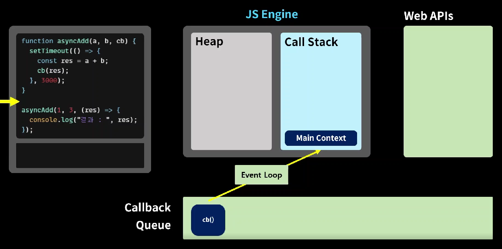
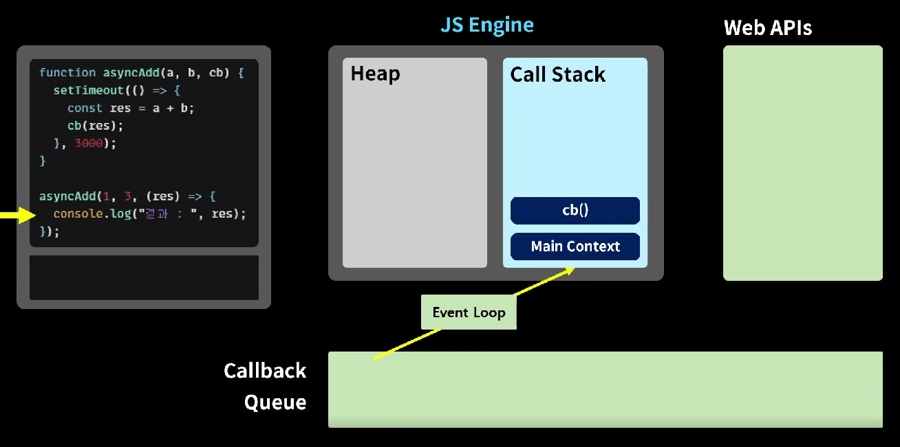

# JavaScript 응용


---

# 1. Truthy & Falsy

```javascript
let a = "";

if (a) {
  console.log("TRUE");
} else {
  console.log("FALSE");
}

>> False
```


```javascript
let a = "string";

if (a) {
  console.log("TRUE");
} else {
  console.log("FALSE");
}

>> True
```


```javascript
let a = [];

if (a) {
  console.log("TRUE");
} else {
  console.log("FALSE");
}

>> True
```


```javascript
let a = undefined;

if (a) {
  console.log("TRUE");
} else {
  console.log("FALSE");
}

>> False
```


```javascript
const getName = (person) => {
  return person.name;
};

let person = { name: "조창현" };
const name = getName(person);
console.log(name);

>> 조창현
```


```javascript
const getName = (person) => {
  return person.name;
};

let person;
const name = getName(person);
console.log(name);

>> type error
```


```javascript
const getName = (person) => {
  if (!person) { // falsy 속성을 이용하여 문제 해결
    return "객체가 아닙니다.";
  }
  return person.name;
};

let person;
const name = getName(person);
console.log(name);

>> 객체가 아닙니다
```


---

# 2. 삼항 연산자


---

# 3. 단락 회로 평가

```javascript
const getName = (person) => {
  return person && person.name;		// falsy && falsy 연산이라 and 연산 그냥 첫 값 falsy를 보고 바로 falsy값 반환
};

let person;
const name = getName(person);
console.log(name);
```


```javascript
const getName = (person) => {
  const name = person && person.name;	// truthy && truthy라서 name 조창현을 name에 저장
  return name || "객체가 아닙니다.";	   // truthy || truthy라서 or 연산 첫 truthy인 조창현 반환
};

let person = { name: "조창현" };
const name = getName(person);
console.log(name);
```


```javascript
const getName = (person) => {
  const name = person && person.name; // name에 null 값 저장
  return name || "객체가 아닙니다.";	 // name이 falsy라서 뒤를 봐 뒤가 truthy니까 출력
};

let person = null;
const name = getName(person);
console.log(name);
```


---

# 4. 조건문 업그레이드

```javascript
function isKoreanFood(food) {
  if (["불고기", "떡볶이", "비빔밥"].includes(food)) {	//.include() 파라미터가 []배열 안에 있는지???
    return true;
  }
  return false;
}

const food1 = isKoreanFood("불고기");
console.log(food1);


>> true
```


```javascript
const meal = {
  한식: "불고기",
  중식: "멘보샤",
  일식: "초밥",
  양식: "스테이크",
  인도식: "카레"
};

const getMeal = (mealType) => {
  return meal[mealType] || "굶기";	// key인 중식에 해당하는 value값이 truthy로 리턴
};

console.log(getMeal("중식"));		//mealType이 중식으로 들어가서 
console.log(getMeal());
```


---

# 5. 비 구조화 할당

```javascript
let arr = ["one", "two", "three"];

let [one, two, three] = arr;	// 배열의 기본변수 비 구조화 할당
console.log(one, two, three);
```


```javascript
let [one, two, three] = ["one", "two", "three"];	// 배열의 선언분리 비 구조화 할당
console.log(one, two, three);
```


```javascript
let [one, two, three, four] = ["one", "two", "three"];
console.log(one, two, three, four);		//값을 할당받지 못해 undefined
```


```javascript
let [one, two, three, four = "four"] = ["one", "two", "three"];
// 할당받지 못할 변수에는 four 처럼 기본 값을 설정할 수 있음
console.log(one, two, three, four);
```


```javascript
let a = 10;
let b = 20;

[a, b] = [b, a];	// 순서를 바꾼 배열을 이용하여 스왑이 가능!!
console.log(a, b);
```


```javascript
let object = {
  one: "1",
  two: "2",
  three: "3",
  name: "조창현"
};

let { name, one, two, three } = object;		//객체는 key값으로 스왑을 하는거라 순서가 의미 없음
console.log(one, two, three, name);
```


```javascript
let object = {
  one: "1",
  two: "2",
  three: "3",
  name: "조창현"
};

let { name: myName, one, two, three } = object;		// :을 이용하면 원하는 변수명으로 바꾸어서도 사용 가능
console.log(one, two, three, myName);
```


```javascript
let object = {
  one: "1",
  two: "2",
  three: "3",
  name: "조창현"
};

let { name: myName, one, two, three, abd = "four" } = object;	// 여전히 기본값 설정이 가능하다.
console.log(one, two, three, myName, abd);
```


---

# 6. Spread 연산자

```javascript
const cookie = {
  base: "cookie",
  madeIn: "korea"
};

const chocochipCookie = {
  ...cookie,	// Spread연산자 ...으로 위의 객체를 펼처준다.
  toping: "chocochip"
};

const blueberryCookie = {
  ...cookie,
  toping: "blueberry"
};

const strawberryCookie = {
  ...cookie,
  toping: "strawberry"
};

console.log(chocochipCookie);
console.log(blueberryCookie);
console.log(strawberryCookie);
```


```javascript
const noTopingCookies = ["촉촉한 쿠키", "안촉촉한쿠키"];
const topingCookies = ["바나나쿠키", "블루베리쿠키", "딸기쿠키", "초코칩쿠키"];

// 배열도 ... 으로 펼쳐줄 수 있다.
const allCookies = [...noTopingCookies, "함정쿠키", ...topingCookies];	//중간에 껴서 출력도 가능해
console.log(allCookies); //
```


---

# 7. 동기 & 비동기

- 동기 방식의 처리
  - Thread 단위로 처리한다.
  - 코드가 작성된 순서대로 작업을 처리한다.
  - 이전 작업이 진행 중 일때 다음 작업을 수행하지 않고 기다린다. (블로킹 방식)
  - 먼저 수행중이던 코드를 마무리 하고 다음 코드를 실행한다.
  - **<u>but!!</u>** 한줄 한줄의 작업이 너무 길어지면 답답 할 수 밖에 없다.


- 비동기 작업
  - 여러 개의 작업을 동시에 실행 시킨다. (논 블로킹 방식)
  - 먼저 작성된 코드를 기다리지 않고 다음 코드를 실행해버린다.


```javascript
function taskA() {
  setTimeout(() => {	// 타이머를 만들 수 있는 내장 '비동기' 함수
    console.log("A task end");
  }, 2000);
}

taskA();			   // taskA를 기다리지 않고 
console.log("코드 끝"); // 코드 끝 부터 출력
```


```javascript
function taskA(a, b, cb) {
  setTimeout(() => {
    const res = a + b;
    cb(res);	// 콜백 함수로 res를 반환
  }, 3000);		// 3초 수행
}

function taskB(a, cb) {
  setTimeout(() => {
    const res = a * 2;
    cb(res);
  }, 1000);	// 1초 수행
}

function taskC(a, cb) {
  setTimeout(() => {
    const res = a * -1;
    cb(res);
  }, 2000);	// 2초 수행
}

taskA(3, 4, (res) => {
  console.log("A task result : ", res);	// 콜백 함수로 받아온 res사용
});

taskB(7, (res) => {
  console.log("B task result : ", res);
});

taskC(14, (res) => {
  console.log("C task result : ", res);
});

console.log("코드 끝");
```


## JS Engine

- Heap
  - 메모리 할당
- Call Stack
  - 코드 실행


- 동기적 방식
  - 순서대로 콜 스택에 쌓이고 
  - 위에서 부터 순서대로 실행 후 out
  - 


- 비동기적 방식
  - 콜 스택에 쌓는거는 전과 동일
  - 
  - 비동기 함수를 웹 APIs로 넘겨줘
  - 웹 APIs에서 따로 돌고 콜스택은 asyncAdd 실행
  - 
  - 셋 타임아웃이 다 수행되면 cb() 함수는 콜백큐로 옮겨짐
  - 
  - Event Loop는 콜스택에 Main을 제외한 다른 함수가 남아 있는지 계속 확인
  - 다른 함수가 모두 수행 되었다면 cb()함수를 수행할 수 있으니 
  - cb()를 넘겨준다.
  - 


```javascript
function taskA(a, b, cb) {
  setTimeout(() => {
    const res = a + b;
    cb(res);
  }, 3000);
}

function taskB(a, cb) {
  setTimeout(() => {
    const res = a * 2;
    cb(res);
  }, 1000);
}

function taskC(a, cb) {
  setTimeout(() => {
    const res = a * -1;
    cb(res);
  }, 2000);
}

taskA(4, 5, (a_res) => {		// A를 수행
  console.log("A result : ", a_res); 
  taskB(a_res, (b_res) => {		// A의 수행결과를 B로 보내서 수행
    console.log("B result : ", b_res);
    taskC(b_res, (c_res) => {	// B의 수행결과를 C로 보내서 수행
      console.log("C result : ", c_res);
    });
  });
});								// 콜백지옥 ㅜㅠ

console.log("코드 끝"); //
```


---

# 8. Promise - 콜백 지옥에서 탈출하기

- Pending : 대기 상태, 비동기 작업이 진행중이거나 작업을 시작 할 수 없는 문제가 발생한 상태
  - resolve 해결 : Fulfilled 상태로 넘어간다.
  - reject 거부 : Rejected 상태로 넘어간다.
- Fulfilled : 이행, 성공 상태로 비동기 작업이 우리의 의도대로 잘 이행된 상태
- Rejected : 거부, 실패 비동기 작업이 어떠한 이유로 실패한 상태


```javascript
function isPositive(number, resolve, reject) {
  setTimeout(() => {
    if (typeof number === "number") {			// 2. 10이 숫자니까 if문 실행
      resolve(number >= 0 ? "양수" : "음수");	 // 3. 삼항연산자를 수행하고 resolve(콜백함수)로 넘겨줌
    } else {
      reject("주어진 값이 숫자형 값이 아닙니다.");
    }
  }, 2000);
}

isPositive(
  10,											// 1. 우선 10이 넘어감
  (res) => {
    console.log("성공적으로 수행됨 : ", res);	  // 4. resolve를 res로 받아서 실행
  },
  (err) => {
    console.log("실패 하였음 : ", err);
  }
);
```


```javascript
function isPositiveP(number) {						//2. number로 101이 넘어옴
  const executor = (resolve, reject) => {
    // 비동기를 실행하는 executor실행자
    setTimeout(() => {
      if (typeof number === "number") {				//4. number 101이니 if문 실행
        // 성공 -> resolve
        resolve(number >= 0 ? "양수" : "음수");		 //5. 삼항연산자 판별하여 콜백함수 실행 "양수 넘어감"
      } else {
        //실패 -> reject
        reject("주어진 값이 숫자형 값이 아닙니다.");
      }
    }, 2000);
  };

  const asyncTask = new Promise(executor);			//3. 여기 실행
  // 비동기 작업 자체인 (promise 객체)를 (생성자 executor)를 이용하여 생성하고
  // asyncTask 상수에 저장
  return asyncTask;									//6. asyncTask에 콜백 "양수" 저장 후 반환
}

const res = isPositiveP(101);						//1. 함수에 101을 파라미터로 실행하여 res에 저장
													//7. res에 resolve "양수" 넘어옴

res													//8. resolve면 then, reject면 catch 실행
  .then((res) => {									//9. resolve로 왔으니까 여기 실행
    console.log("작업 성공 : ", res);
  })
  .catch((err) => {
    console.log("작업 실패 : ", err);
  });
```


```javascript
function taskA(a, b) {
  return new Promise((resolve, reject) => {
    setTimeout(() => {
      const res = a + b;
      resolve(res);
    }, 3000);
  });
}

function taskB(a) {
  return new Promise((resolve, reject) => {
    setTimeout(() => {
      const res = a * 2;
      resolve(res);
    }, 1000);
  });
}

function taskC(a) {
  return new Promise((resolve, reject) => {
    setTimeout(() => {
      const res = a * -1;
      resolve(res);
    }, 2000);
  });
}

taskA(5, 1).then((a_res) => {					// 딱히 콜백 지옥에서 탈출한듯 하지 않아....
  console.log("A result : ", a_res);			// promise는 이렇게 사용하는게 아니거든
  taskB(a_res).then((b_res) => {
    console.log("B result ; ", b_res);
    taskC(b_res).then((c_res) => {
      console.log("C result : ", c_res);
    });
  });
}); //
```


```javascript
function taskA(a, b) {
  return new Promise((resolve, reject) => {
    setTimeout(() => {
      const res = a + b;
      resolve(res);
    }, 3000);
  });
}

function taskB(a) {
  return new Promise((resolve, reject) => {
    setTimeout(() => {
      const res = a * 2;
      resolve(res);
    }, 1000);
  });
}

function taskC(a) {
  return new Promise((resolve, reject) => {
    setTimeout(() => {
      const res = a * -1;
      resolve(res);
    }, 2000);
  });
}

taskA(5, 1)									//taskA가 하나의 promise
  .then((a_res) => {						//taskA의 then 실행
    console.log("A result : ", a_res);
    return taskB(a_res);					//taskA의 결과값을 이용한 taskB promise 리턴
  })
  .then((b_res) => {						//taskB의 then 실행
    console.log("B result : ", b_res);
    return taskC(b_res);					//taskB의 결과값을 이용한 taskC promise 리턴
  })
  .then((c_res) => {						//taskC then 수행
    console.log("C result : ", c_res);
  }); 										//이렇게 then 체이닝 형성
```

