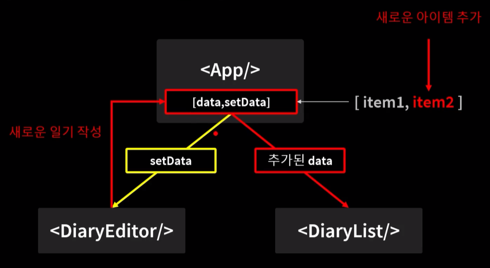
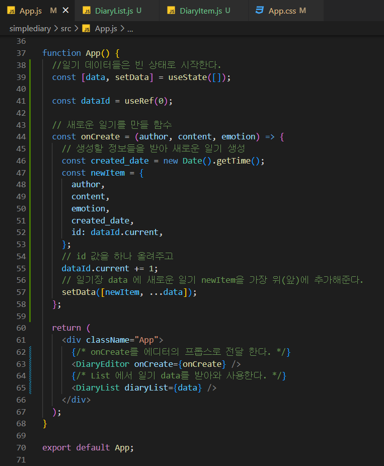
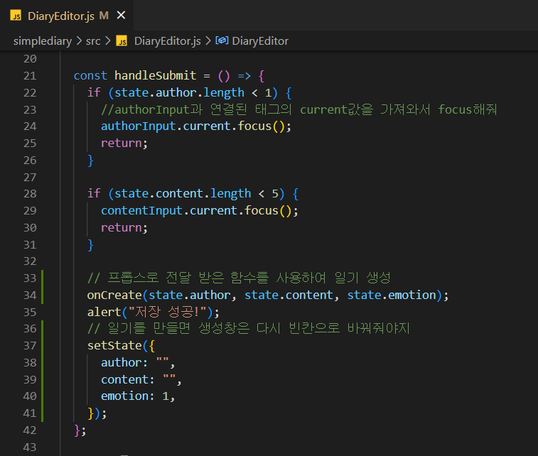
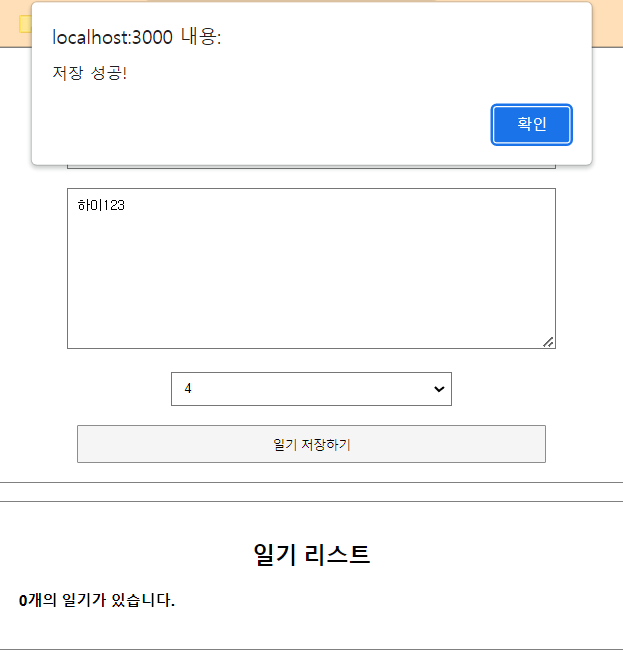
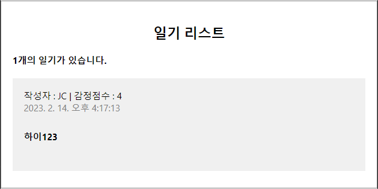

# React 기본 - 간단한 일기장 프로젝트

---

## 참고

https://www.inflearn.com/course/%ED%95%9C%EC%9E%85-%EB%A6%AC%EC%95%A1%ED%8A%B8/dashboard

# 0. 프로젝트 소개

## 일기장 작성 사이트를 만든다

---

# 1. React에서 사용자 입력 처리하기

- userState를 이용하여 작성자 입력란을 만들어준다.
  - 

- onChange 함수로 매개변수 e 를 이용하여 값을 조작 할 수 있다.
  - 빈칸에 값을 입력하려 하면 콘솔창에 onChange 함수가 작동하는 걸 볼 수 있다.
  - 
  - 더 상세하게 확인하여 e.target.value 를 보면 
  - 
  - 

- 위의 과정들로는 수정 하는 거 까지는 못해 setAuthor 함수를 이용해 줘야함
  - 
  - 

- 하지만 이렇게 바꾸는 거마다 함수를 만들기는 귀찮아
  - 하나로 묶어주자
  - 

- 그런데 여기서 setState 속 바뀌지 않는 값들이 많아지면 변수들이 너무 많아져
  - 스프레드 연산자를 이용해 바뀌지 않는 값들은 기본값으로 가져올 수 있어 순서는 중요해!! 수정하는 코드를 가장 마지막에!!
  - 

- setState도 너무 반복이 심해져

  - handle을 이용하여 하나의 함수로 관리해줘
  - 

  - emotion 이라는 감정 점수도 하나 추가
  - 
  - 
  - 저장 버튼도 하나 추가
  - 
  - 

---

# 2. React에서 DOM 조작하기 - useRef

- 사이트의 운영자가 원하는 입력 값의 범위가 있을 것이다. 이러한 제한 요소들을 핸들러로 구현할 수 있다.
  - 
  - 

- 하지만 이렇게 alert 창을 띄우는 건 이제 트랜드에서 좀 동떨어진 구현이다
- 따라서 우리는 focus를 이용할 것이다.

  - 함수형 컴포넌트에서 ref를 사용 할 때는 useRef 라는 Hook 함수를 사용한다.
  - 
  - 
  - 

  - 

---

# 3. React에서 리스트 사용 하기

- 배열을 통해 구현하기

  - 일기들의 양이 많아진다면 각각의 일기를 관리할게 아니라 이렇게 List로 묶어서 한번에 관리하는 것이 더 좋아!

  - 

  - App.js 에서 List 를 props 로 넘겨주고

  - 

  - List 를 컴포넌트화 해준다.

  - 

  - 

    

  - 만약 List가 undefined 라든지 멀쩡한 값으로 넘어갈 수 없을 경우라면  defaultProps를 이용해줘

  - 

- key 정해주기

  - 위와 같이 코드를 작성 했다면 경고가 보일 것이다.
  - 
  - List의 각각의 요소들이 key 값을 가져야 한다
  - 
  - 이러면 경고창이 사라진다.

- 우리 프로젝트는 나중에 가면 각각의 Item 들을 수정 삭제까지 가능할 수 있게 할 것이다. 따라서 List 로 한번에 묶는 것 보다 각각의 Item 으로 컴포넌트화 하는 것이 더 좋다.

  - 

  - css 도 손봐줘서 그럴듯 하게 만들어보자
  - 

---

# 4. 리스트 데이터 추가하기

- 리액트에서의 데이터 구조

  - DiaryEditor 와 DiaryList 사이에서는 데이터를 직접적으로 주고 받을 수 없다.
  - 따라서 DE에서 setData 함수로 정보를 변경하고 
  - 변경된 data 가 DL로 전달 되어 표시되도록 한다.
  - 
  - App.js에 setData 와 data 를 만들고 onCreate 함수도 만들어 준다.
  - 

  - Editor에서 props로 onCreate함수를 전달 받아 새로운 일기를 만든다.
  - 

  - 
  - 

#  4. 리스트 데이터 추가하기

- 리액트에서의 데이터 구조
  - DiaryEditor 와 DiaryList 사이에서는 데이터를 직접적으로 주고 받을 수 없다.
  - 따라서 DE에서 setData 함수로 정보를 변경하고
  - 변경된 data 가 DL로 전달 되어 표시되도록 한다.

- App.js에 setData 와 data 를 만들고 onCreate 함수도 만들어 준다.

- Editor에서 props로 onCreate함수를 전달 받아 새로운 일기를 만든다.

---

# 5. 리스트 데이터 삭제하기

- App.js 에 onDelete 함수를 만들고 DiaryList에 props로 넘겨줘

- props 로 전달받은 List 는 또 개별 Item 으로 onDelete 를 전해줘

- DiaryItem에서 버튼을 만들고 onClick 메서드로 onDelete 를 사용할 수 있도록 해줘

---

# 6. 리스트 데이터 수정하기