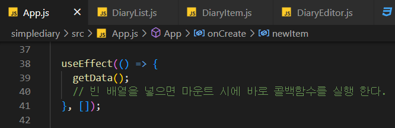
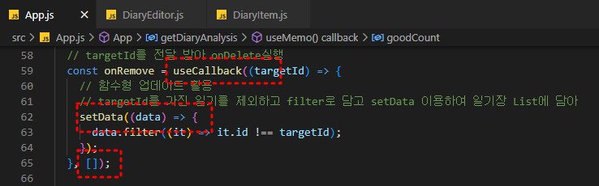

# React 기본 - 간단한 일기장 프로젝트

---

## 참고

https://www.inflearn.com/course/%ED%95%9C%EC%9E%85-%EB%A6%AC%EC%95%A1%ED%8A%B8/dashboard


# 0. 프로젝트 소개

## 일기장 작성 사이트를 만든다


---

# 1. React에서 사용자 입력 처리하기

- userState를 이용하여 작성자 입력란을 만들어준다.
  - 


- onChange 함수로 매개변수 e 를 이용하여 값을 조작 할 수 있다.
  - 빈칸에 값을 입력하려 하면 콘솔창에 onChange 함수가 작동하는 걸 볼 수 있다.
  - 
  - 더 상세하게 확인하여 e.target.value 를 보면 
  - 
  - 

- 위의 과정들로는 수정 하는 거 까지는 못해 setAuthor 함수를 이용해 줘야함
  - 
  - 


- 하지만 이렇게 바꾸는 거마다 함수를 만들기는 귀찮아
  - 하나로 묶어주자
  - 


- 그런데 여기서 setState 속 바뀌지 않는 값들이 많아지면 변수들이 너무 많아져
  - 스프레드 연산자를 이용해 바뀌지 않는 값들은 기본값으로 가져올 수 있어 순서는 중요해!! 수정하는 코드를 가장 마지막에!!
  - 


- setState도 너무 반복이 심해져

  - handle을 이용하여 하나의 함수로 관리해줘
  - 

  - emotion 이라는 감정 점수도 하나 추가
  - 
  - 
  - 저장 버튼도 하나 추가
  - 
  - 


---

# 2. React에서 DOM 조작하기 - useRef

- 사이트의 운영자가 원하는 입력 값의 범위가 있을 것이다. 이러한 제한 요소들을 핸들러로 구현할 수 있다.
  - 
  - 


- 하지만 이렇게 alert 창을 띄우는 건 이제 트랜드에서 좀 동떨어진 구현이다
- 따라서 우리는 focus를 이용할 것이다.

  - 함수형 컴포넌트에서 ref를 사용 할 때는 useRef 라는 Hook 함수를 사용한다.
  - 
  - 
  - 

  - 


---

# 3. React에서 리스트 사용 하기

- 배열을 통해 구현하기

  - 일기들의 양이 많아진다면 각각의 일기를 관리할게 아니라 이렇게 List로 묶어서 한번에 관리하는 것이 더 좋아!

  - 

  - App.js 에서 List 를 props 로 넘겨주고

  - 

  - List 를 컴포넌트화 해준다.

  - 

  - 

    

  - 만약 List가 undefined 라든지 멀쩡한 값으로 넘어갈 수 없을 경우라면  defaultProps를 이용해줘

  - 

- key 정해주기

  - 위와 같이 코드를 작성 했다면 경고가 보일 것이다.
  - 
  - List의 각각의 요소들이 key 값을 가져야 한다
  - 
  - 이러면 경고창이 사라진다.

- 우리 프로젝트는 나중에 가면 각각의 Item 들을 수정 삭제까지 가능할 수 있게 할 것이다. 따라서 List 로 한번에 묶는 것 보다 각각의 Item 으로 컴포넌트화 하는 것이 더 좋다.

  - 

  - css 도 손봐줘서 그럴듯 하게 만들어보자
  - 


---

# 4. 리스트 데이터 추가하기

- 리액트에서의 데이터 구조

  - DiaryEditor 와 DiaryList 사이에서는 데이터를 직접적으로 주고 받을 수 없다.
  - 따라서 DE에서 setData 함수로 정보를 변경하고 
  - 변경된 data 가 DL로 전달 되어 표시되도록 한다.
  - 
  - App.js에 setData 와 data 를 만들고 onCreate 함수도 만들어 준다.
  - 

  - Editor에서 props로 onCreate함수를 전달 받아 새로운 일기를 만든다.
  - 

  - 
  - 


---

# 5. 리스트 데이터 삭제하기

- App.js 에 onDelete 함수를 만들고 DiaryList에 props로 넘겨줘


- props 로 전달받은 List 는 또 개별 Item 으로 onDelete 를 전해줘


- DiaryItem에서 버튼을 만들고 onClick 메서드로 onDelete 를 사용할 수 있도록 해줘


---

# 6. 리스트 데이터 수정하기

## App.js


- onEdit 함수를 만들어준다.


- onEdit함수를 프롭스로 전달해준다.


## DiaryList.js


- onEdit을 그대로 DiaryItem으로 전달 해준다.


## DiaryItem.js


- 프롭스로 받은 함수들을 컴포넌트에 추가해주고


- 수정을 위한 기능들을 구현해준다.


- 각 버튼에 onClick 메서드로 기능들을 연결해준다.


---

# 7. React Lifecycle 제어하기

## Lifecycle?

> 생애주기란, 일반적으로 시간에 흐름에 따라 탄생부터 죽음에 이르는 순간까지 단계적인 과정이다.


- 위의 그림이 React에서의 Lifecycle이다.


- 엄밀히 따지면 Lifecycle 메서드는 클래스 기반의 코드에서만 사용이 가능하다.
- 하지만 클래스형 코드는 함수형 코드에 비해서 길이가 길어지고, 중복이 많이 되며 가독성이 좋지 못하다는 문제들이 있다.


## Hooks?


- 그래서 등장한 것이 바로 Hooks이다.
- hooks는 함수형 컴포넌트에서도 Lifecycle 함수를 사용할 수 있도록 개발된 것으로 use를 이용하는 함수들이 바로 그 결과물이다.


- use함수를 이용한 Hooks의 형태는 위와 같다. 
- 현재의 추세는 가능하면 함수형 컴포넌트로 개발을 진행하는 것이다.


## Lifecycle.js


- UnmountTest 컴포넌트


- Lifecycle 컴포넌트


- on/off를 누르면 UnmountTest컴포넌트가 mount 되면서 함수 내의 콘솔 내용이 찍히고


- on/off를 누르면 UnmountTest컴포넌트가 unmount 되면서  return값이 불려와진다.


---

# 8. React에서 API 호출하기

## App.js


- json placeholder의 더미 데이터를 API로 가져올거야


- https://jsonplaceholder.typicode.com/comments
- comments 데이터를 가져올거임


####  - getData


- getData로 API에서 정보를 가져온다.



- 마운트시 바로 가져오도록 작성해준다.


- 콘솔에 찍으면 이렇게 불러온걸 볼수 있다.


#### - getData > initData


---

# 9. React developer tools


- react 개발에 무척 도움이 되는 툴!


- 이렇게 Components와 Profiler가 react developer tools가 제공해주는 거야


- props, state, key 값 등등 여러 가지 정보들을 편하게 볼 수 있도록 제공해줘!


- 여기의 highlight 옵션은 컴포넌트가 update 되고 있으면 해당 컴포넌트를 표시해줘


- 위와 같이 노란줄로 표시해줘


- state의 변화도 실시간으로 확인 할 수 있어


------

# 10. 최적화1 - 연산 결과 재사용

## - Memoization

> 한번 실행한 연산의 결과를 기억해 두었다가 다음에 같은 연산을 요구할 때, 기억했던 결과를 바로 반환하는 방법


## - 감정분석 함수 추가


- 이렇게 프로그램을 작성하면 getDiaryAnalysis가 두번 실행해


- 가장 처음에 data를 불러오면 아무런 정보가 없어 그 상태에서 getDiaryAnalysis가 한번 실행이 되고 


- 이후에 getData에서 data를 update하게 되면 App 컴포넌트를 relender 하게 되고 getDiaryAnalysis가 다시 실행이 되면서 결과를 가져온다.
- 하지만 이렇게 작성하면 함수의 값에 전현 관련이 없는 relender 상황에서도 다시 연산을 수행해서 비효율적이다.
- 이럴때 useMemo를 사용할 수 있다.


- 이렇게 수정해주면 data의 길이가 변화할 때만 함수를 다시 실행해줘!

> 어떠한 값을 return하는 함수가 있을 때 return까지의 연산을 최적화 하고 싶다면 useMemo를 사용하여 어떤 값이 변할때 이 함수를 수행할지 명시하면 이 함수를 값처럼 사용하여 최적화를 수행해 줄 수 있다.


------

# 11. 최적화2 - React.memo

## - react.memo


- 코드를 작성하다 보면 이렇게 비효율적인 리렌더가 이루어질 수 있다.


- 이렇게 해당 조건을 걸어 비효율적인 업데이트 상황을 피할 수 있다.

[
React 최상위 API – ReactA JavaScript library for building user interfacesko.reactjs.org](https://ko.reactjs.org/docs/react-api.html#reactmemo)

> React.memo
>
> ```
> const MyComponent = React.memo(function MyComponent(props) {
>   /* props를 사용하여 렌더링 */
> });
> ```
>
> 컴포넌트가 동일한 props로 동일한 결과를 리렌더링해낸다면, React.memo를 호출하고 결과를 메모이징(Memoizing)하도록 래핑하여 경우에 따라 성능 향상을 누릴 수 있습니다. 따라서, React는 컴포넌트를 렌더링하지 않고 마지막으로 렌더링된 결과를 재사용합니다.


- 실험을 위해 OptimizeTest 라는 컴포넌트를 새로 만든다.
- countView와 textView를 만들어 화면에 띄워준다.


- count만을 변화 시켜도 text의 값이 리렌더 된다.


- 이렇게 React.memo를 이용해서 함수를 감싸주면 안쪽의 함수를 props로 인식하고 이 props가 바뀔 때 리렌더를 수행해준다.


- 새롭게 코드를 작성해본다. 이번에는 자신에게 자신을 다시 넣어주는 방식으로 작성한다. 이러면 props의 변화는 없을테니 콘솔이 찍히지 않을 것이라 생각된다.


- 실제로 A는 리렌더 되지 않았지만 B는 변화가 없어도 리렌더가 되는 것으로 보인다.


- 이유는 JS가 객체, 함수 또는 비원시 타입을 비교할 때 주소에 의한 비교를 하기 때문이다.


- JS가 객체를 비교할 때는 이렇게 주소가 같은 경우에 Equal 이라고 판단한다.


> props가 같는 복잡한 객체에 대해서는 앝은 비교만 하는 것이 기본이다. 이럴때 다른 비교동작을 원하면, 두 번째 인자로 별도의 비교함수를 제공할 수 있다.
>
> ```
> function MyComponent(props) {
>   /* props를 사용하여 렌더링 */
> }
> function areEqual(prevProps, nextProps) {
>   /*
>   nextProps가 prevProps와 동일한 값을 가지면 true를 반환하고, 그렇지 않다면 false를 반환
>   */
> }
> export default React.memo(MyComponent, areEqual);
> ```


- 위와 같이 areEqual을 이용해서 객체 속의 값까지 비교 가능해


 

------

# 12. 최적화3 - useCallback

## - RDT를 이용하여 최적화 해보자


- 어떠한 컴포넌트를 최적화 할 것인가?!
- 이를 위해서 우리는 React Developer Tools 의 Highlight 기능을 이용할 것이다. 이 기능으로 어떤 수정을 가할 때 어떤 컴포넌트들이 반응하는지 파악하고 최적화를 해준다.

 

## - DE를 최적화 해보자


- DE는 props로 받는 onCreate 함수가 변할 때 리렌더 된다.
- useEffect를 이용해서 console로 언제 렌더링 되는 지도 찍어보자


- 전에 사용했던 React.memo를 이용하여 최적화 해보자


- App.js 를 보면 마운트 되자마자 두번 렌더링을 진행해 따라서 DE도 두번 onCreate가 렌더링 됨에 따라 같이 렌더링
- onCreate가 값이라면 React.memo 만으로 최적화가 가능 하겠지만 함수여서 반복 렌더링

 

### - useCallback

```
const memoizedCallback = useCallback(
  () => {
    doSomething(a, b);
  },
  [a, b],
);
```

> 메모이제이션된 콜백함수를 반환하는 훅으로
> 의존성 배열인 [ ] 안의 값이 바뀌는 게 아니면 { } 속의 함수를 그대로 재사용 할 수 있도록 해준다.


- 이렇게 useCallback을 이용하여 onCreate함수를 감싸주니 더이상 다른 동작을 할때 DE가 리렌더 되지 않는다.


- 그런데 저장이 이상하게 동작한다


- 위에서 의존성 배열에 [ ] 빈 배열을 넣어 주어서 그렇다.


- 그렇다고 이렇게 data를 받게 되면 이전과 마찬가지고 data가 바뀔 때마나 onCreate함수가 리렌더 되고 DE가 리렌더


- 이렇게 함수형 업데이트로 해결 가능해!


------

# 13. 최적화 최종!

## - DiaryItem.js 를 최적화 해보자


- DI 를 보면
- **onEdit**, **onRemove**함수 그리고 수정이 가능한 **content**를 props로 받는다.
- 따라서 이 요소들이 불필요하게 렌더링 되지 않게 해주면 최적화 되는 것이다.


- 기본적으로 React.memo를 이용하여 최적화를 하고 useEffect로 또 언제 렌더링 되는지 파악할 수 있도록 한다.


### - onRemove 함수 최적화



- useCallback, 기존의 data를 받아오는 함수형 업데이트, 의존성 배열을 이용하여 최적화


### - onEdit 최적화


- useCallback, 기존의 data를 받아오는 함수형 업데이트, 의존성 배열을 이용하여 최적화 

  