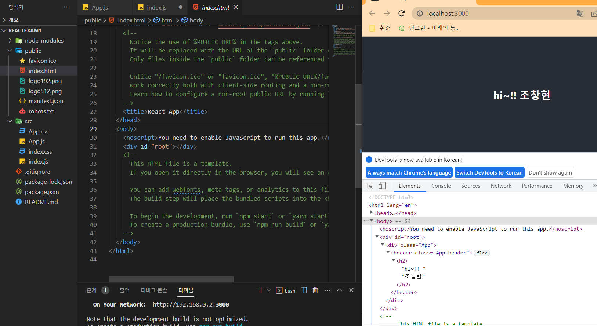
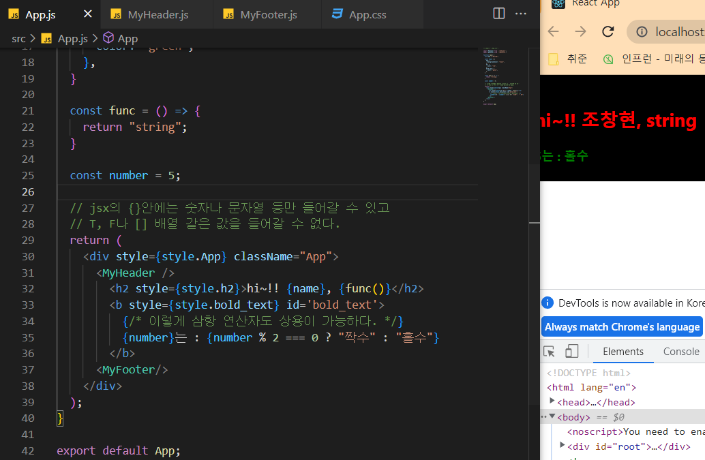
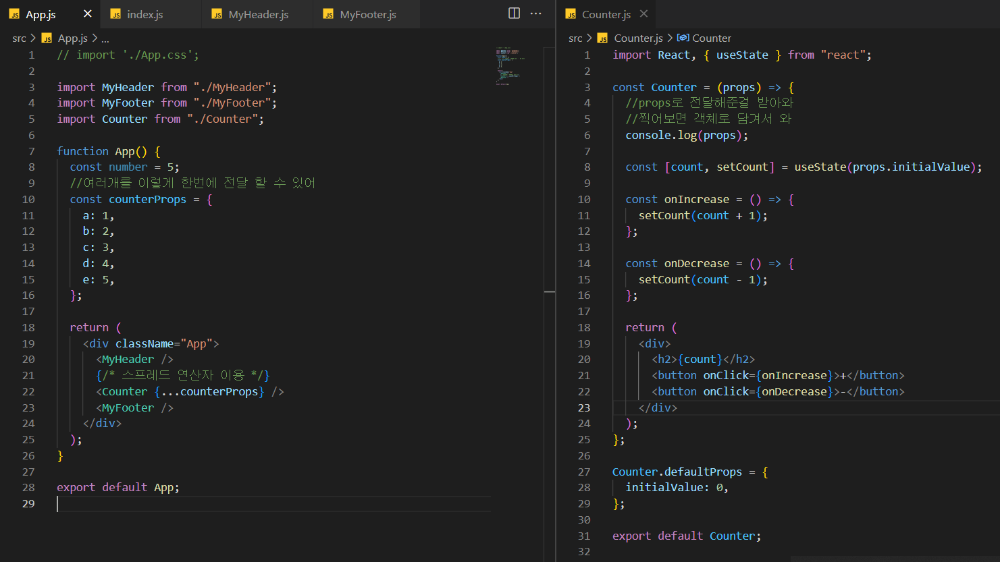

# React.js 기초

---

# 1. Why React.js ?

> - 리액트를 사용해야 하는 첫번째 이유!!
>
> Shotgun Surgery (산탄총 수술) 산탄총에 맞은 사람들을 수술하는 것 처럼 하나의 문제 때문에 여러개의 중복되는 코드를 수정해야 하는 경우를 이야기한다. 산탄총 수술 문제를 해결하기 위해 공통되는 중복 코드들을 하나의 컴포넌트로 만들어두고 이를 편하게 불러와 사용하도록 한다. (컴포넌트화 방식) 문제가 발생하면 손봐야하는 컴포넌트만 수정하면 문제 해결!
>
> React가 바로 Component 기반의 UI 라이브러리 이다!!


> - 리액트를 사용해야 하는 두번째 이유!!
>
> 기존의 명령형 프로그래밍은 절차를 하나하나 전부 나열해야 한다.
>
> 명령형 ex)
>
> 1. 결과를 표시할 요소를 가져온다. (id = result)
> 2. 현재 결과값을 10진수 기준, 숫자형으로 변환해서 가져와 current라는 상수에 저장한다.
> 3. current라는 상수에 저장된 값을 결과를 표시할 요소의 값에 plus하면 +1해서 넣고, minus라면 -1해서 넣는다.
>
> 리액트는 선언형 프로그래밍으로 목적을 바로 선언하는 방식으로 개발을 진행한다. 
>
> 리액트 ex)
>
> 1. plus를 누르면 result값에 +1 한다. minus를 누르면 반대로 한다.
>


> - Virtual DOM
>
> Document Object Model의 약자로 실제로 브라우저가 사용하는 객체로 html을 해석하기 쉽게 트리 형태로 변환한 객체이다.


---

# 2. Create React App

> react로 앱을 만들 때는 여러가지 환경 설정이 필요하다. 하지만 매번 이렇게 많은 준비 과정을 거친다면 시간이 낭비될 것이니 이미 세팅이 완료된 패키지 (Boiler Plate) 인 Create React App 을 이용하여 프로젝트를 생성해 줄 것이다.
>
```bash
npx create-react-app reactexam1
```


자동으로 이렇게 프로젝트를 생성해 준다.


- app.js 코드를 하나 뜯어보면 function App() 에 html 같은 걸 return 하고, export App; 을 한다.
  - 

- index.js 는 import App 으로 가져와서 root 안에 넣어준다.
  - 

- 그리고 여기서 root는 public 폴더 안에 들어있다.
  - 


---

# 3. JSX

> react의 장점인 컴포넌트들을 만드는데 사용하는 문법

- 이런 식으로 헤더와 푸터를 만들어서 하나를 가지고 여러 곳에서 가져다 쓸 수 있다.
  - 


- css를 이용하여 조작도 가능하다.
  - 


- style 을 직접만들어 적용도 가능하다.
  - 


- { }를 이용하여 변수를 넣거나 연산자를 사용 할 수도 있다
  - 


---

# 4. State(상태)

> 계속해서 변화하는 특정 상태를 이야기 하는 것으로, 상태에 따라 각각 다른 동작을 한다.


- state를 사용하여 동적인 함수들을 구현할 수 있다.
  - 


---

# 5. Props

> props는 properties의 줄임말로, 우리가 어떤 값을 컴포넌트에게 전달 해주어야 할 때, 이 props를 사용한다

- 이런식으로 원하는 값을 전달 할 수 있다.
  - 
  - 


- 여러 값을 전달 할 경우 스프레드 연산자를 이용하여 전달 할 수 있다.
  - 
  - 


- 혹시 잘 못해서 값을 넘겨주지 못할 경우를 대비하여 defaultProps 로 자체적으로 값을 줄 수도 있어
  - 
  - initialValue 를 넘겨주지 않았지만 들어갔다.
  - 


- 프롭스를 전달해서 다양하게 활용할 수 있어
  - 이렇게 삼항 연산자도 사용 가능
  - 
  - 


- 컴포넌트로 props로 전달 할 수 있어

  - 

  - 
